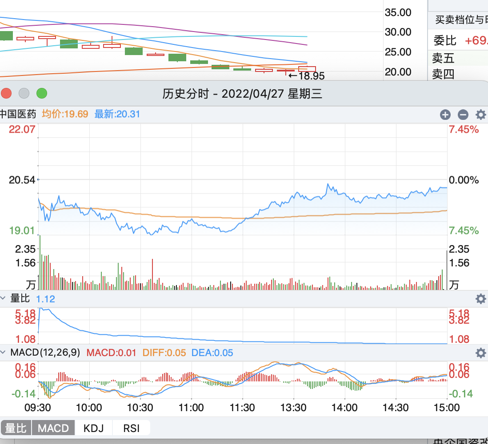
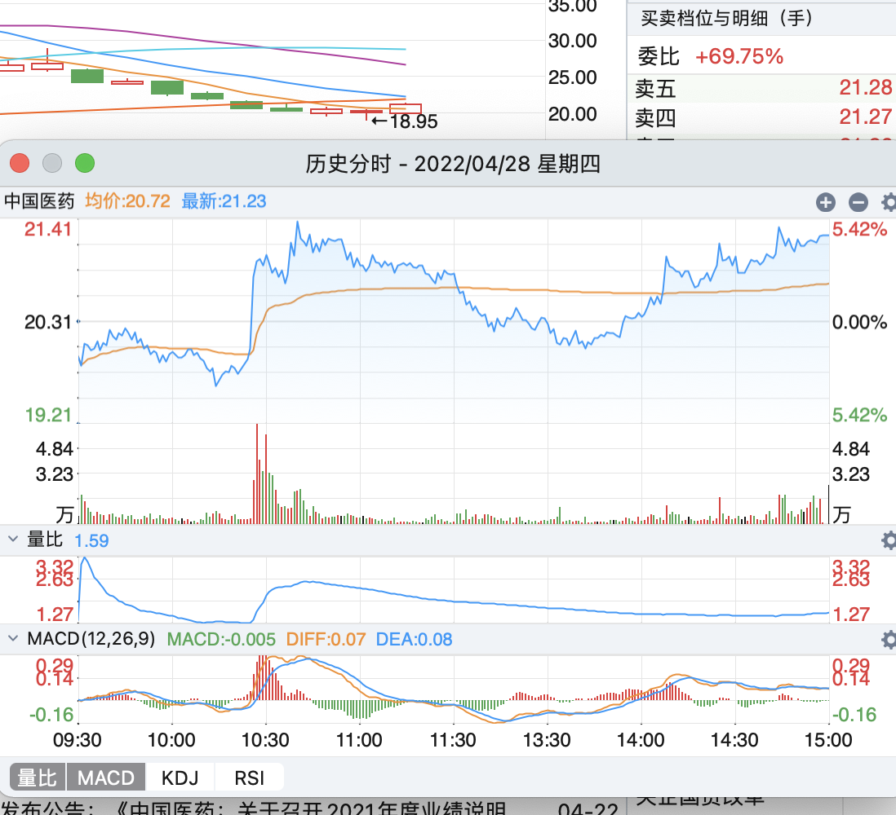
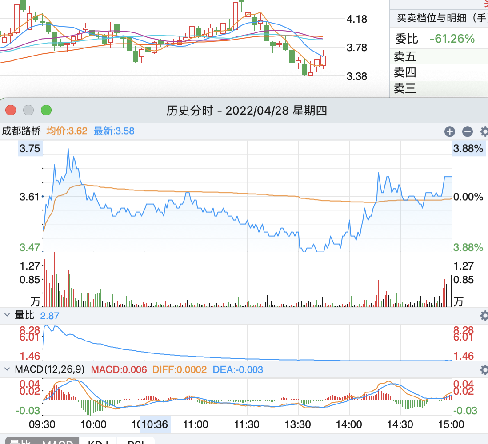
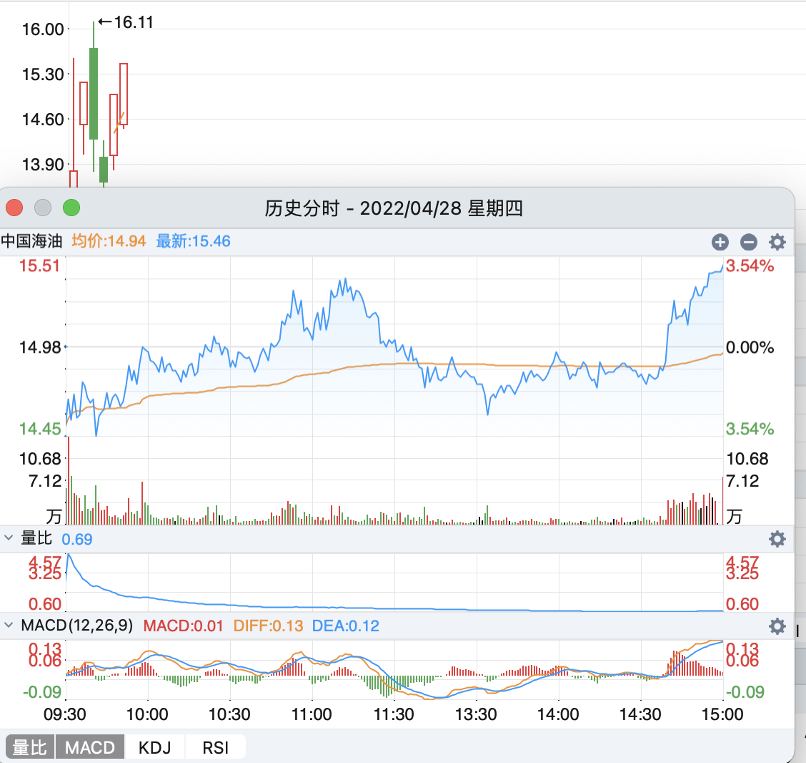
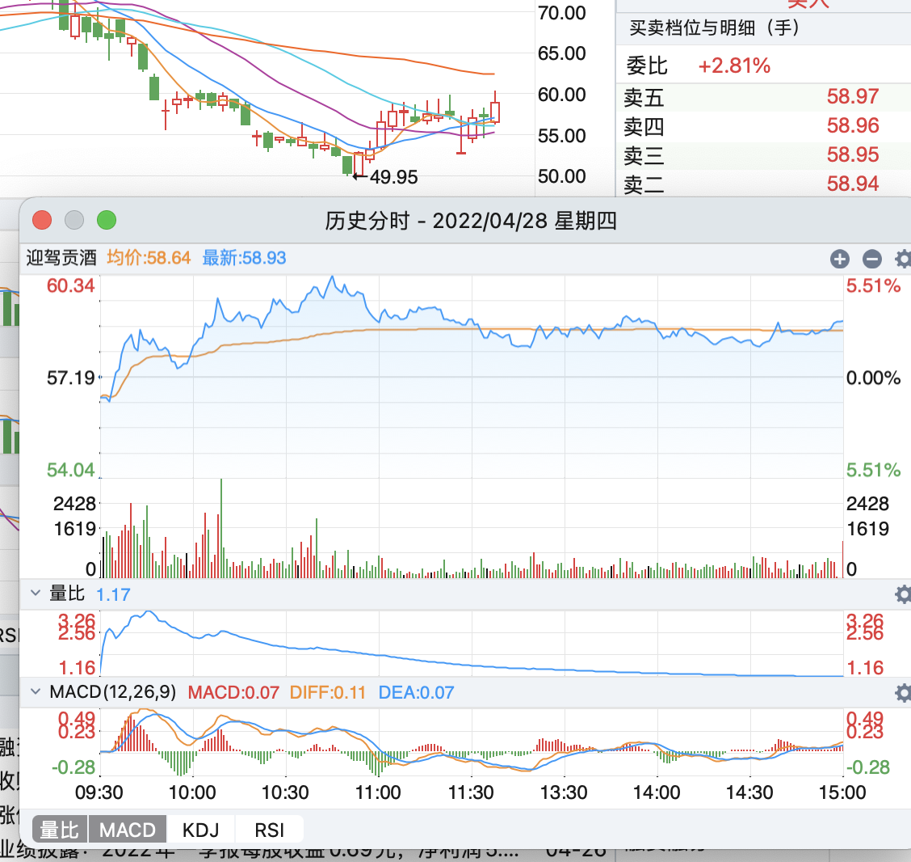
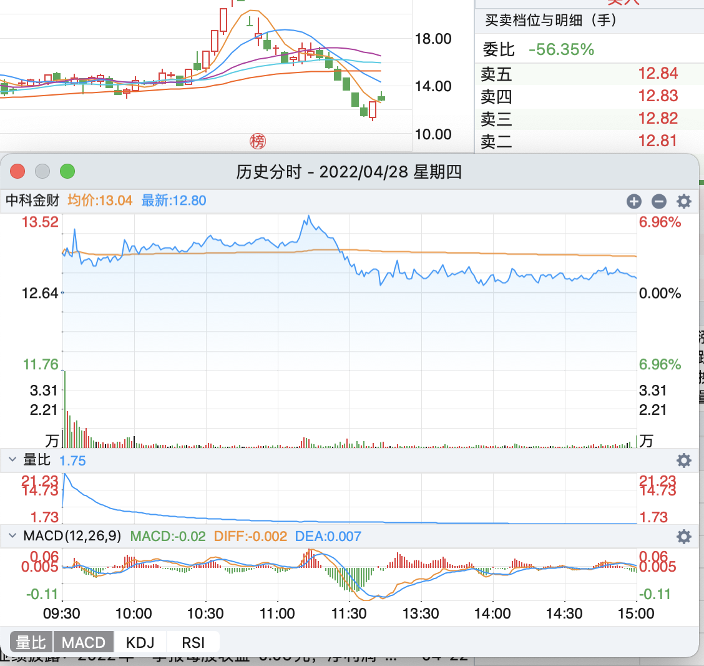
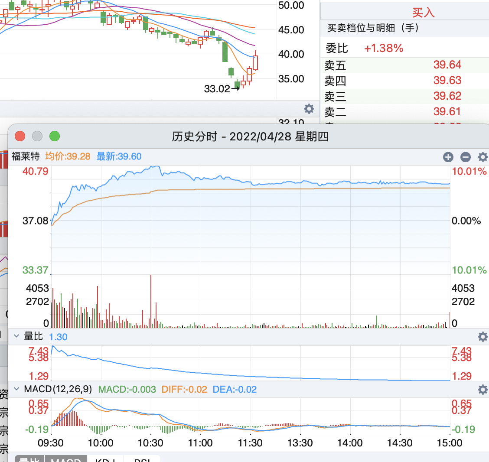
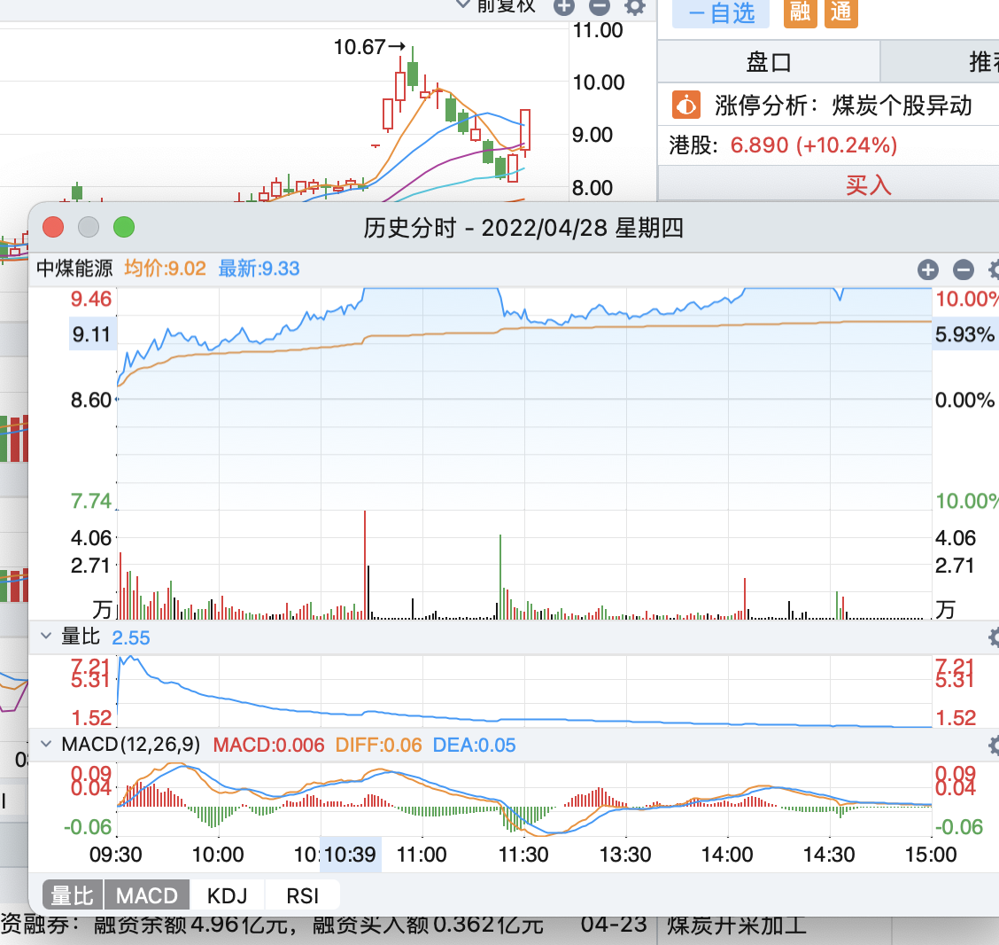

## 每日经验总结

从近一个月的情况看，在混沌期就不适合短线打板，我应该只考虑低位股票，不买高位，我认为重要的原因是龙头妖股变少，不确定性增加，那么持筹方大概率想卖，不敢买。

这个时候就只能找低位股票，我考虑改进自己的情绪周期的方案。目前至少有一定的规律可循。

今天股票卖飞了

昨天买了三只股票，中国医药，已经明显的深T底部，

深T可以说确定性很强，明天上涨基本板上钉钉的事情，这个应该多等一等，或深T 第二天入场

**策略可以考虑第二天先等一等，应该空方先手，后多方后手**

深T 说明博弈激烈，空多相当，且多方更胜一筹，有拉起来的主动性，但是也有害怕的所以一开始抛，

那么我们就跟着多方的节奏，也选择第二天入场

如果没有下跌，那更好，说明高于预期

医药我觉得明天应该也继续涨，因为预期更一致，我认为涨幅更大。

成都路桥 前一天加速涨，今天应该分歧，应该考虑尾盘买入，而不是加速涨时买，分歧点谁知道涨跌，所以就抛了

形态好，以及基建板块不错，预计明天加速涨

中国海油

这个卖了有点可惜，看到看盘低开，其实这个位置低开很正常，不是山顶上的低开，看趋势上涨，可以等一等的，形态很好，中间跌了又尾盘涨了回来，预计明天要加速涨了

结果预计的这三个明天都是加速涨，哎。。

今天买入

迎驾，因为预计加速跌，结果反而涨了，中间回落应该是被高点压制，明天加速涨

中科金财

前一天突然被拉起来，今天这么个走势，难道是主力吸筹？ 我认为不会只涨一波，明天看看，预测加速涨

福莱特

今天应该算加速涨，但是没涨停，这样第二天分歧凶多极少，有可能低开高走，不是这个走势尽早卖

中煤能源，加速涨并且涨停，明天至少能涨，而且应该加速，这要是没加速就走不起来了

