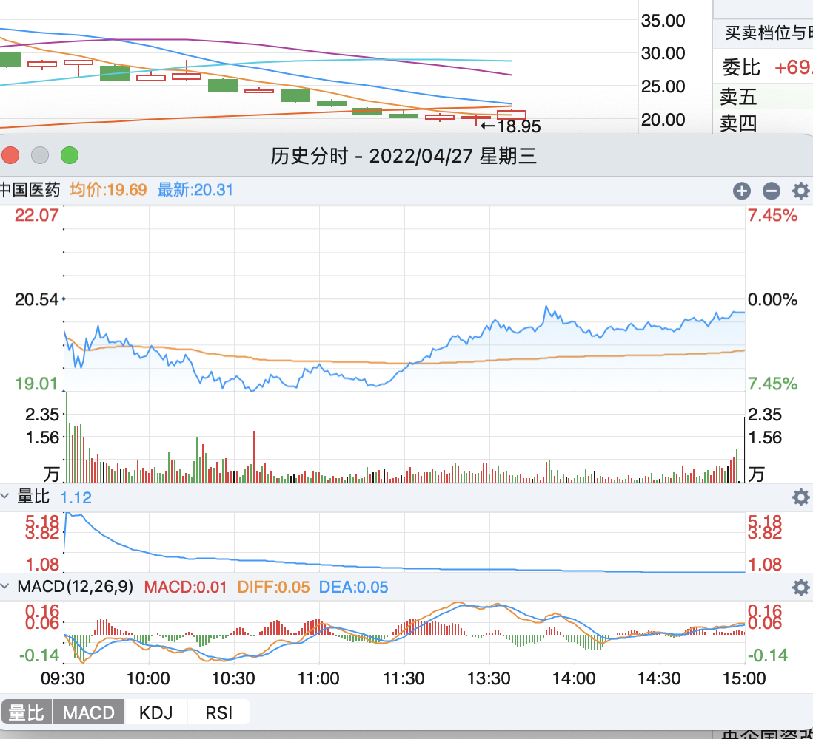
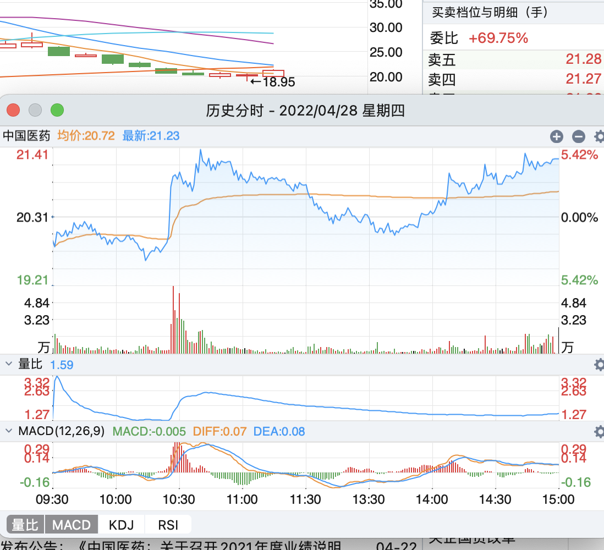
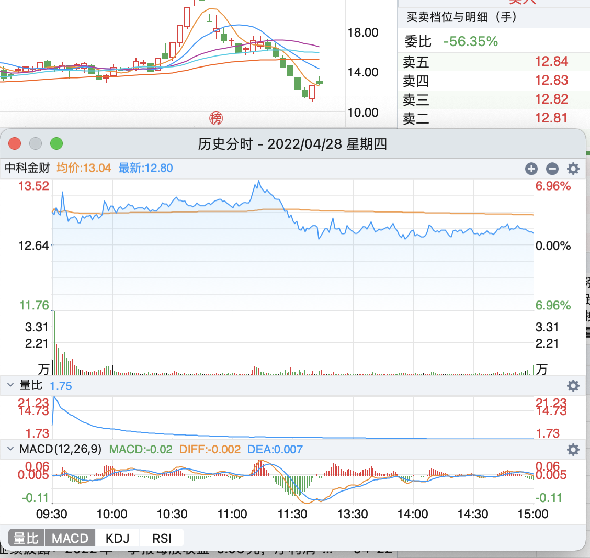
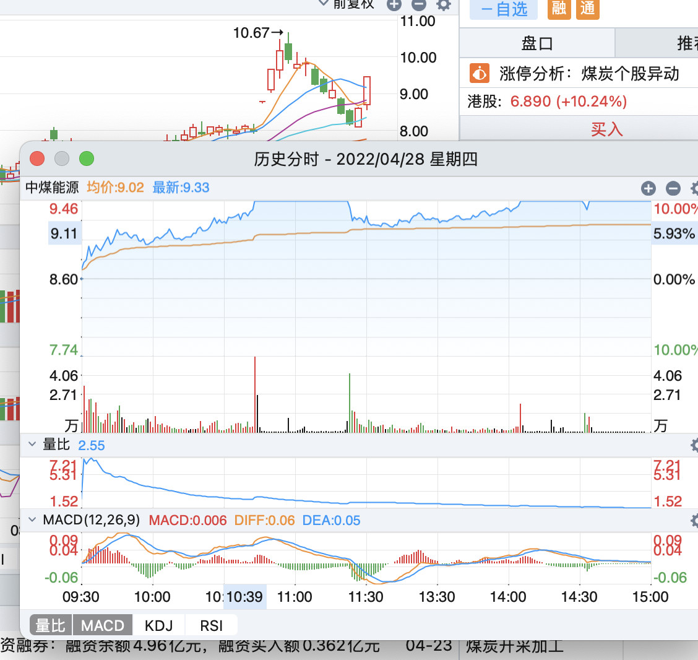
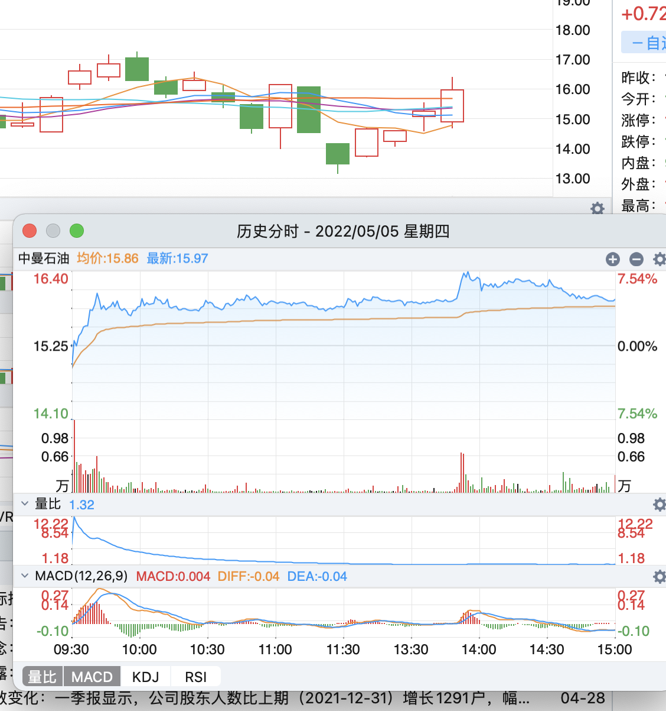

## 每日经验总结

从近一个月的情况看，在混沌期就不适合短线打板，我应该只考虑低位股票，不买高位，我认为重要的原因是龙头妖股变少，不确定性增加，那么持筹方大概率想卖，不敢买。

这个时候就只能找低位股票，我考虑改进自己的情绪周期的方案。目前至少有一定的规律可循。

今天股票卖飞了

昨天买了三只股票，中国医药，已经明显的深T底部，

深T可以说确定性很强，明天上涨基本板上钉钉的事情，这个应该多等一等，或深T 第二天入场

**策略可以考虑第二天先等一等，应该空方先手，后多方后手**

深T 说明博弈激烈，空多相当，且多方更胜一筹，有拉起来的主动性，但是也有害怕的所以一开始抛，

那么我们就跟着多方的节奏，也选择第二天入场

如果没有下跌，那更好，说明高于预期

医药我觉得明天应该也继续涨，因为预期更一致，我认为涨幅更大。

成都路桥 前一天加速涨，今天应该分歧，应该考虑尾盘买入，而不是加速涨时买，分歧点谁知道涨跌，所以就抛了

形态好，以及基建板块不错，预计明天加速涨

中国海油

这个卖了有点可惜，看到看盘低开，其实这个位置低开很正常，不是山顶上的低开，看趋势上涨，可以等一等的，形态很好，中间跌了又尾盘涨了回来，预计明天要加速涨了

结果预计的这三个明天都是加速涨，哎。。

今天买入

迎驾，因为预计加速跌，结果反而涨了，中间回落应该是被高点压制，明天加速涨

第二天操作，预期加速涨，开盘往下跌，果断卖了，卖对了

中科金财

前一天突然被拉起来，今天这么个走势，难道是主力吸筹？ 我认为不会只涨一波，明天看看，预测加速涨

第二天没有加速涨，没有突破前一天压位，第三天应该加速涨了，拭目以待

福莱特

今天应该算加速涨，但是没涨停，这样第二天分歧凶多极少，有可能低开高走，不是这个走势尽早卖

第二天福莱特早盘低走就卖了，但是尾盘回来，看后第三天加速涨买入

中煤能源，加速涨并且涨停，明天至少能涨，而且应该加速，这要是没加速就走不起来了

没加速其他，往下跌，显然有问题哦，早盘就卖了，预期加速跌，不过有一点，空间已经打开，说不定反而加速涨了

## 4月29日操作

##### 上海三毛

早盘买入三毛，这里空间开阔，唯一，可能顶板太早被抛盘了，但趋势上看好第二天加速涨

早上平开，就卖了，为什么先平后涨，这个其实我没看懂，说明我还没理解透，之前的分析方法要推倒重来

##### 中国海油

我只能说，上海三毛和中国海油的买点，我自己都觉得很牛，当时很果断，可能也是因为才买一万的原因吧，没犹豫

这里中海油应该是加速涨，所以看到符合加速涨，且中海油本就热门，果断买入没有错

中海油第四天分歧日，反而因为连板效应，以及筹码，在别人的体系内应该是足够好的票，所以分歧日能继续加速，拭目以待。

我觉得甚至可以考虑打板，一但起来应该能继续走下去，只是不能投入太多，准备加一万吧

意外，只能说跟随市场吧

##### 卖出迎驾贡酒

前一天应该有白酒行情，且加速跌意外涨，所以买入等第二天走势，这说明一个问题，这里的加速跌意外涨其实不是买点，因为所处的未通知已经算高了，也不能算买错，继续看看。

第二天预期加速涨没走起来，那就果断卖了

##### 福莱特

9:43 卖出福莱特，尾盘竞价买入福莱特，10日线支撑，20日线压制，看好后一天加速涨突破

有突破只是突破的不多，看好后一天继续加速

##### 中曼石油

前一天我把中曼石油放入加速跌的行列中，超预期，所以买入，这里其实有一点风险，另一个买入原因是中海油，结果中曼石油不及预期，没跟中海油一起涨，所以后一天走势很蹊跷，看情况

这里对比猜测一下中海油，中曼石油走势原因，

可能是油气还没普涨，那标杆中海油更吸引人，另一个原因可能是已经足够高了，持筹方卖出获利

第二天确实加速涨了，但我没看懂

#### 焦点科技

预期加速跌没跌，意外涨，就按照模式买入，没想到中午，资本市场利好出来后，直接拉涨停，这里我觉得一个重要的原因是他在低位！

所以拉涨停空间很多，看后一天分歧走势，注意我的买法连续涨停的概率应该不大，考虑合适的未知卖掉套利，除非超预期

第二天确实分歧，但很明显超预期了，应该多留着，我当时的想法是手上票太多了难管理，就都卖了

##### 城发环境

跟焦点科技一样，有惊喜，就果断买入， 被10日线压制，看好后一天分歧日突破

第二天没有突破，感觉第三天有戏

##### 中国医药

这个买点我觉得很牛，**最高处被10/55线压制， 尾盘竞价买入很多(这应该是一群做T的人)**，不知道会不会被13日线压制，看看吧， 感觉没走起来，套了太多可能得取关了，从另一个角度，可能会回到半山腰见顶，如今价格恰好是顶部的一半

卖早了，当时想着尽快卖了，票多了难管理，心态出现了变化

##### 武汉凡谷

我觉得跟焦点，城发一类，只是没走出来，被10日线压制，看好后一天突破

没形成有效突破，看好后一天

##### 中科金财

这一笔操作明细有误，11点10分卖出，大部分时间大于均值，应该再等等，第二次没起来再考虑卖

下午1点06分买入，应该是看好利好消息的上涨，结果没走出来，这个应该在模式内，也没啥好说的，预期加速涨

注意10日线在13.9附近，收盘价13.19，涨5% 之后就到10日线压力位了，获利了结吧，看其他好机会

中财金科，不行就是不行

### 下周题材

房地产，基建，医药，中海油，国家安全

