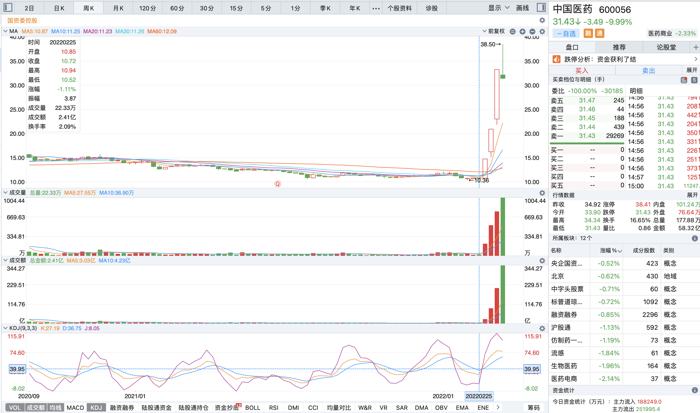
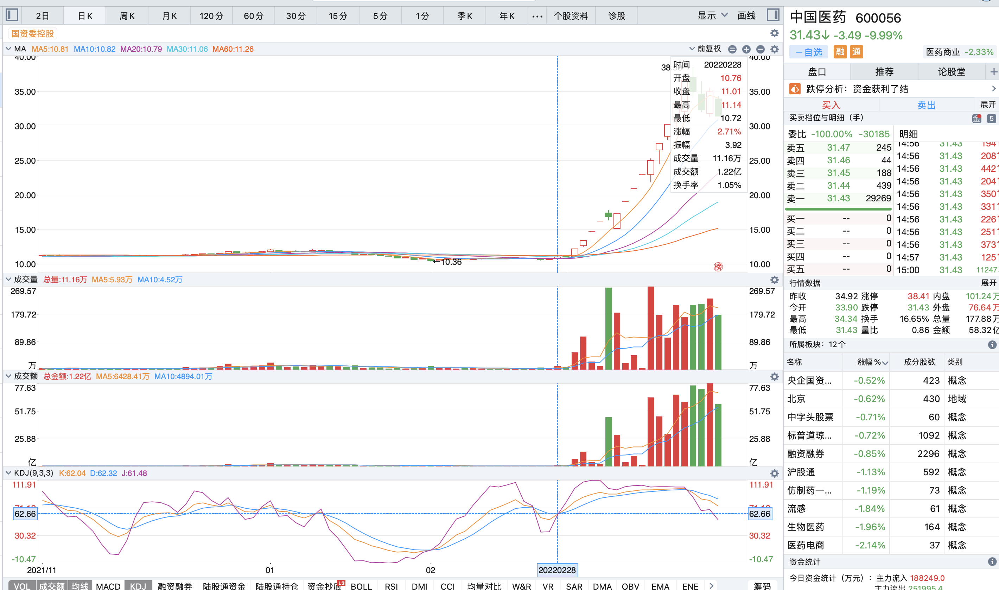
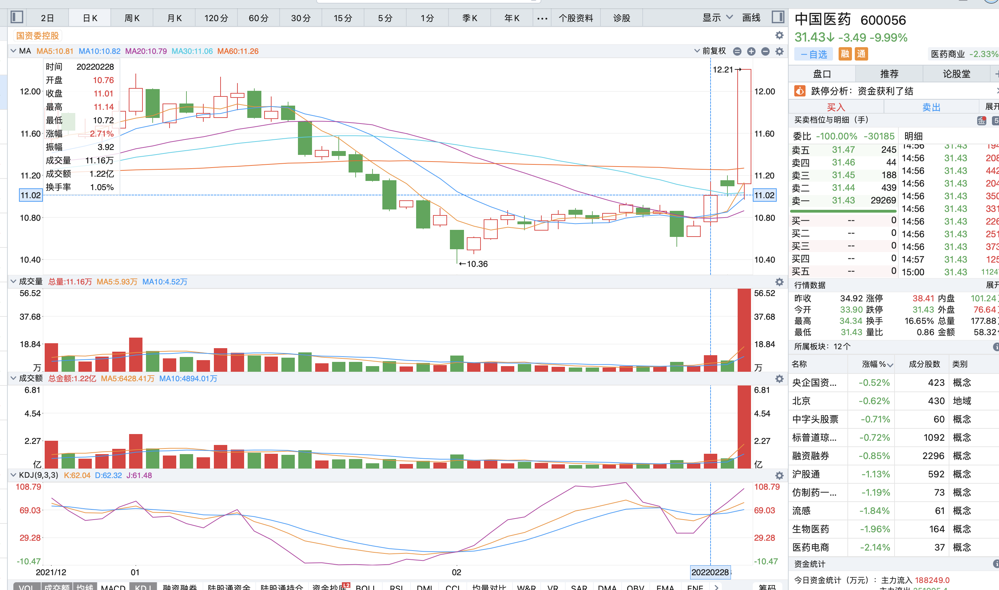

## 前言

看短线高手asking 曾说他看的第一本书《短线英雄》，所以拜读一下，其中提到：

> 如果非得从技术上判断最佳跟庄点的haul，那么我这里有个稳定获利的方法：股价在30日均线以上运行，周KDJ 形成有效金叉，日KDJ一旦调整到位，三日均线带量上扬（最好是近期首次放量），此时进场获利基本上有保证，因为此时你抓的正是主力机构的咽喉。此法适用于100万一下(*按照现在人民币升值应该不止100万*)小资金运作，也仍属业余系统，并不是专业投资者的境界。

因此特地研究一下KDJ，参见： [10分钟学会随机指标(KDJ) | 短线抄底技巧 | K线技術分析新手入門教学系列](https://www.bilibili.com/video/BV1jy4y1g7r2)

单纯运用以上视频中 KDJ 买点信号的方式，找了几只股票，有用但未必，所以需要其他信号考量。

这里主要分析如上《短线英雄》中稳定获利方式的含义，

> 股价在30日均线以上运行

猜测是指不能处于弱势

## 实例分析

#### 中国医药

这个例子没有代表性，因为它恰好在各地开始爆发疫情行情内，只是先找个代表性的研究，后续再找其他合适的例子和反例

周KDJ 在 2022/02/25 - 2022/03/04 之间出现金叉

随后2022/02/28出现日KDJ金叉

未满足条件的是出现金叉时运行在30日均线下，且没有放量，知道03/02才出现一次巨大的放量

