## 一，操作回顾

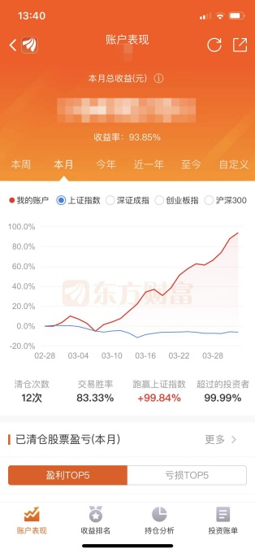


**三月总收益：93.85%，一共交易13笔**

3.30 低吸北玻股份，止盈6%+

因为北玻股份从市场的角度看待的话，依然属于真正的市场空间破冰者，在情绪逐步回暖的时候低吸北玻股份没有任何毛病，至于能不能日出一个大长腿，这种事儿就交给市场了。(**做正确的交易，不管盈亏与否**)

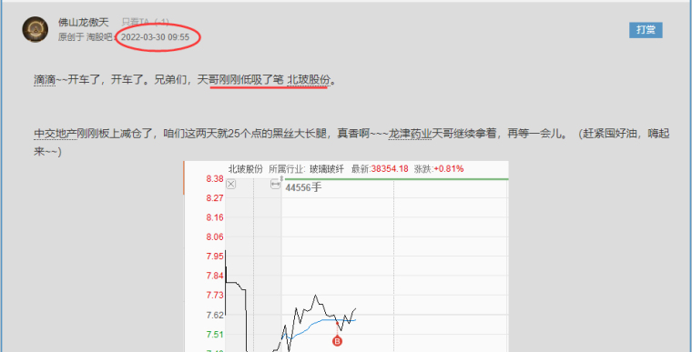

3.29 低吸中交地产 止盈32%

了解天哥的小伙们都知道，天哥接力连板，一般都喜欢挑换手充分的(**疑问: 什么叫做换手充分？**)，这样才能够有足够的预期差，而昨晚天哥在复盘里面已经说过了*房地产*已经确认为主线了，昨天房地产的前排保9版，肯定不会再去接力了，而是选择下面的连板

```
我猜这里意思是，既然市场情绪已经确定房地产作为主线，那就没必要继续拉高龙头股，而是从**后排连板**股票中选择
```

海泰发展早上大单顶死一字四连板，那个时候能够选择的就是下面的二进三。

```
为什么不买一字板，一方面处于加速板极限，获利风险高，且主力也不会考虑继续跟加速板了，一般是韭菜散户承接加速版了
那么就找后排的做
```

二连板里面，形态量价都比较好看的就是中交地产(**TODO 分析为什么形态量价好**)了，早上也是平开，这样容易扛住早上的分歧，像其他几个二板，开盘竞价都比较差，主要原因还是他们的形态没有那么漂亮，以及*三湘印象*开盘顶太高了，还没有换手就上板，不被砸才怪。中交地产**换手之后(如何看出换手)**再上板，自然没有那么容易被砸死，尽管午后再次炸板，收盘出现爆量，都是非常完美的。

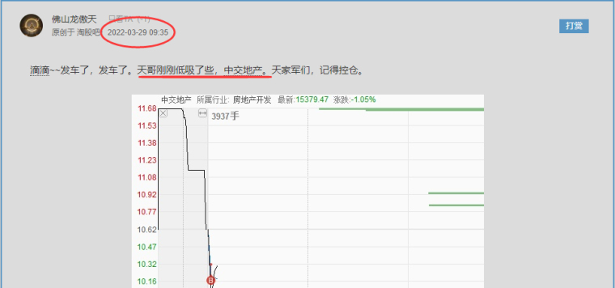


3.29 低吸 *龙津药业* 止盈13%

早上的低吸那笔主要还是为了防守，看好资金午后回流医药(事实是资金确实回流了医药)，原因是房地产今天早上分歧很明显，可惜的是中药前双龙头(精华，龙津)午后无人问津，不断创分时新低，不过这笔交易既然是防守，必然是安全的。

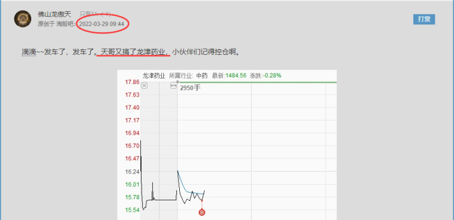

3.28 半路*天保基建* 止盈8%

至于为什么周五早上开盘就卖了*九安医疗*，切换到*天保基建*，可以看昨天的帖子，里面已经说的很明白了。想要保证稳定盈利，前提是要踩对市场的节奏，而想要踩对市场的节奏，那必须熟悉市场的剧本(了解后面市场可能的走势)，这样买的票才能事半功倍。

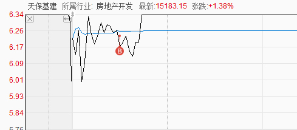

**（注：以下操作全部在评论区有记录，在之前的帖子里面，每一次的买入逻辑也都讲过了，感兴趣的小伙伴可以回去看）**

**3.24 半路 九安医疗 止盈7%+**

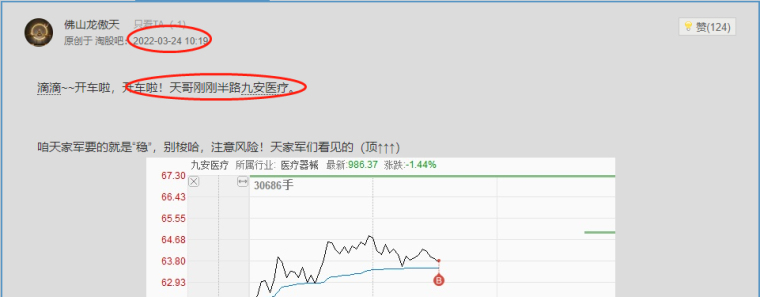

**3.22 低吸 [粤海饲料](https://www.taoguba.com.cn/new/stockbar/barRedirect?stockName=粤海饲料) 止盈16%+**

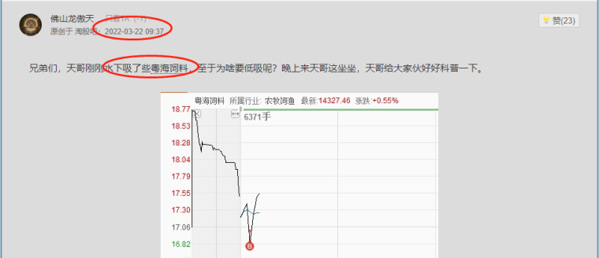


**3.18 深水低吸 [北化股份](https://www.taoguba.com.cn/new/stockbar/barRedirect?stockName=北化股份) 止盈1%+**

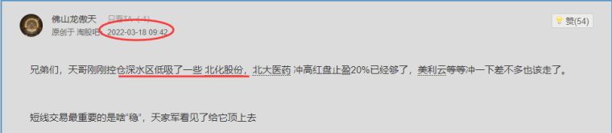

**3.16 低吸[北大医药](https://www.taoguba.com.cn/new/stockbar/barRedirect?stockName=北大医药)止盈20%+**

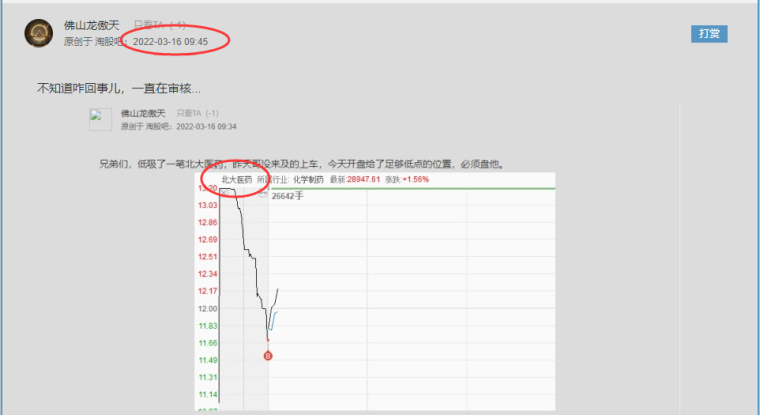

**3.15 低吸美丽云 止盈15%+**

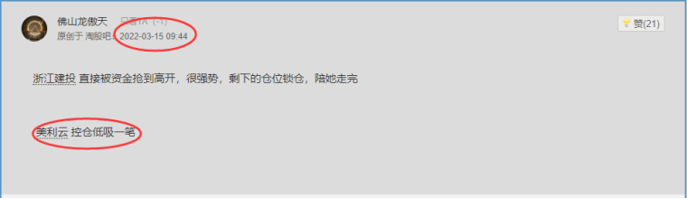

**3.11 半路 [浙江建投](https://www.taoguba.com.cn/new/stockbar/barRedirect?stockName=浙江建投) 止盈30%+**

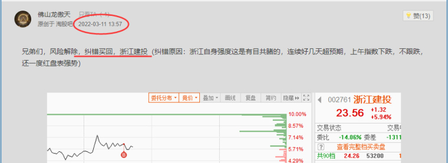

**3.08 半路浙江建投止盈8%+**

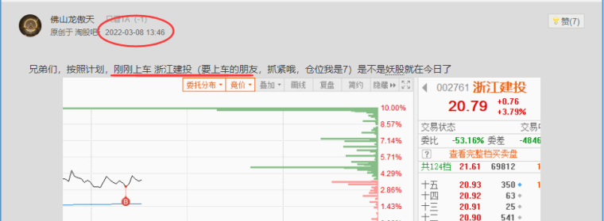

**3.04 低吸 九安医疗 止损11%（三月唯一亏损的一笔交易，但这也是模式之内的面，该吃还得吃。没有谁可以做到百分百胜率）**

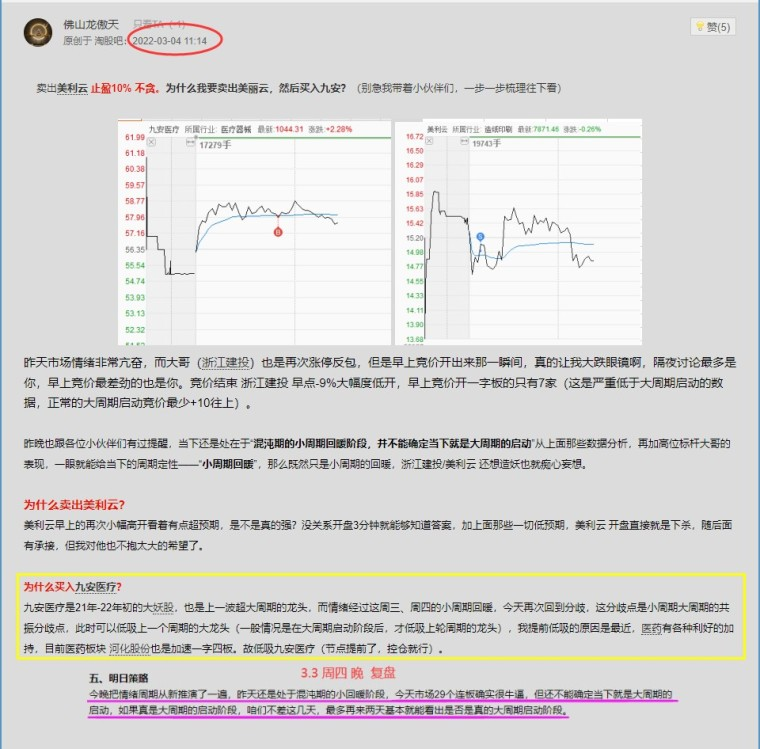

**3.02 低吸 [美利云](https://www.taoguba.com.cn/new/stockbar/barRedirect?stockName=美利云) 止盈10%+**

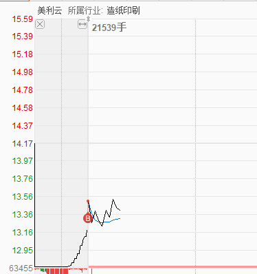

## 二、交易系统如何建立

什么是交易系统？ 在我的理解就是: **心法 + 模式 = 交易系统**


心法是道，道就是规律，规律来自于对股市的深刻理解，来自于多年实战的经验总结。

模式是对股市规律认识的基础上系统归纳出适合自己的操作手法。

```
这一句非常重要！意思是先懂规律，这是基础，在这之上才选择策略。

佛山龙傲天选择在主流换手板买入的意义在于，进可攻，退可守，也就是较为稳定风险低的位置买入。
这是他的策略选择，也是我觉得保险的策略选择。

但需要注意的是，**策略来自于心法，先懂股市规律才能建立正确的策略**
```

注: 每个人适合自己的模式都不一样，同样的模式别人用得好，你未必就能用好，适合自己的模式才是最好的模式，也就可以理解为什么很多前辈游资只讲心法，不谈模式。而现在恰恰相反，很多人只讲模式，不谈心法。这就是典型的求术而无道。我认为心法固然重要，每个人的模式也固然不同，但若有游资大佬详细地说一下自己的模式，或许能更快地指引众多散户入门，模式虽不同，但可提供思路，而现在的模式下去完善，去构建适合自己的，现在很多人看了前辈游资大佬的心法依然不得入门，依旧在苦苦探索，思路都没有，更谈不上构建属于自己的模式。本文只是属于自己的交易系统，不可生搬硬套，但是可以提供思路。


#### 1. 先搞清楚以什么为核心？

先说一下本人的经历：天哥以前走过多年弯路，长时间以技术为核心去研究股市，自以为自己的技术也很不错，但现在回过头来看，不是正道。有一段时间以价值投资为核心，终究不得其门，我发现符合价值投资的股都已经高高在上了，要发现还没有挖掘出来的，未来有很大潜力的，或许也有，但其实也存在很多不确定性，后来就抛弃了价值投资之路。我看过很多书，各种经典理论都有深入了解，你能说出来的或许基本上我都看过，但回过头来看，市面上绝大部分书籍都是垃圾，都不是实战家写出来的，其实现在想想也可以理解，从古至今擅长打仗的数不胜数，但有几人有自己的兵法？ 而既能打仗，又能自己出书，写出兵法的寥寥无几。

经过各种弯路，各种探索，**做短线还是要以题材为核心，技术都是次要的，短线而言基本面也不重要**。


##### 题材的分类

1. 主流（能持续较长时间，可以反复炒的，一般会出现几次龙头切换）
2. 支流（主流里面的分支，一个主流里面可以有多个分支，比如大科技，比如现阶段的新基建，大消费。**主流里面的新故事是重点**）
3. 次主流(阶段性热点，主流也不是一直炒一直涨的，这个过程中会出现阶段性热点)
4. 短线热点（持续时间不长）
5. 日内热点(一日游)
6. 非主流（完全跟热点不搭边）

说明： 天哥以**主流热点为主，以阶段性热点为辅**


##### 题材三阶段

1. 纯概念阶段（炒的是想象力，一般为阶段性热点，不足以成为真正的主流）
2. **概念+开始落实（这个阶段通常赚钱效应最好，为真主流，可以反复炒）**
3. 概念+落实+业绩（挑重点炒，**业绩为驱动**，多数个股走趋势，比如去年锂电，风光储等）

说明： **消费能被市场认同才叫题材，不被市场认同，那只是消息**。 题材有没有持续性，不能成为主流，这考验的是眼力，需要想象力：例如经过理想化推演，会改变社会，改变生活方式，改变行业格局，行业未来会收益。

好的题材应该具备想象空间，又能看到开始落实，并不完全是虚的，这样的通常是主流。如果不会判断，那就简单点： 看哪个概念最有赚钱效应，持续时间又长，反复炒的就是主流。


##### 题材炒作的过程

1. 试探（前期有资金试盘）
2. 板块集体试盘（表现为**板块多数股票放量上涨**）
3. 分歧（归于沉寂，表现为横盘几天或迅速下跌）
4. 某只股率先走强，走出上升通道，大家普遍对后市感到不明朗，对该股走强不理解，其他个股横盘待机
5. 启动（板块集体走强，联袂上攻，先启动的个股已走主升浪，连连大涨，接近翻倍）

说明： 以上就是主流题材通常炒作的方式。当然如果持续炒，还有反复有第2阶段，第3阶段，每一阶段都会有一个代表性的领涨个股。


##### 题材的轮动：

1. 主线内的热点轮动
2. 不同主线之间的轮动

```
我认为一个重要的课题是，热点轮动的时机，因为这觉得了上一个热点的消退，下一个热点起来的重要节点
```


#### 2. 情绪周期

上升期-> 高潮期 -> 衰退期 -> 下降期 -> 冰点期 -> 回暖期

说明： 个人把情绪周期分为以上6种，根据不同的周期来指导我大方向上的操作。直播的时候给大家的版本是让大家更好地去理解，到最后大家需要把它全部忘记。至于为什么忘记？ 这个以后你们就懂了，然后再去用这个市场大众通用版本，为什么最后落实到市场通用板块，只有这样才可以更加贴合市场，踩对节奏。


#### 3. 三个系统

1. 环境与情绪系统
2. 题材系统
3. 技术与形态系统

说明：3个系统是独立的系统，在操作的过程中应结合看看，

**环境与情绪系统**决定仓位，决定是进攻还是防守

```
也就是大的层面是强市，还是弱市，强市多做，弱市少做
```

**题材系统**决定选股的方向

```
也就是关注热点板块，先选板块，再选个股
```

**技术与形态系统**决定出击或关注的个股

```
也就是根据放量，换手，等判断是否是值得出手的热门股票
```

以前很长一段时间重点在系统3，而忽略了系统1和2，现在看来缺乏大局观的表现，只看系统3和2也不行，也是缺乏大局观的表现，应该不同的市场环境下对应不同的操作模式和策略。比如行情好的时候我会以追涨为主，行情不好的时候以低吸为主，或直接空仓。选股应以题材为主，技术为辅，操作策略与操作模式应结合市场环境与情绪。

4. 四种模式

1. 打板（行情好的时候才打板，行情不好的时候一般不打板，特别是接力）
2. 半路（这需要久经战场的经验，新手不建议就用这个）
3. 低吸（看似简单，那为什么更多人愿意打板？ 因为打板具有确定性，如果低吸都具有确定性，人人都去低吸了，超高的胜率+盈亏比，简直不要太爽~）
4. 潜伏（根据热点轮动规律提前潜伏）

说明： 四种模式我都做。只是基于不同行情会有不同侧重点，根据题材的运行节奏和不同个股的运行节奏选。


----

## 留言

**天哥最近分享的内容有不少用心的网友去思考，这边有一封站内信天哥发出来和大家分享下。天哥还是建议大家有问题直接评论区问，如果是你们有深度思考的问题，天哥会尽量回复，大家不用发站内信，站内信天哥看的少反而容易没看到**

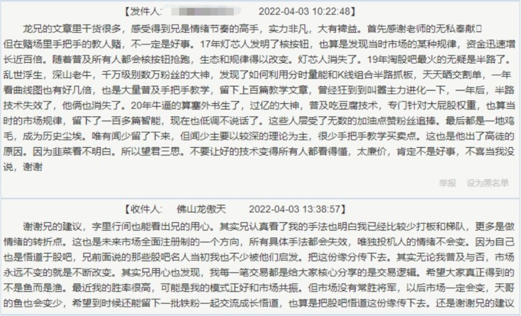


天哥，跟着你学，需要加强学一些哪些基础知识，比如盘口，均线之类的？给点建议

兄弟，对新人来说，学基础没有局限性，越多越好，越杂乱越好，后面走的更远。但这样想悟道也更加困难，因为悟道就是去其糟粕，留其精华，学了太多反而不易消化，有利有弊吧，看兄怎么选择了


天兄 像补量跟分歧是俩个概念么 怎么去分辨开板是因为分歧还是说为了补量嘞 还有和时间有关系吗

兄弟，慢慢学，这东西太多了，天哥一两句话说不完，下次有机会说


天哥，仓位怎么把握的

兄弟，3-5


谢天哥无私分享，天哥技能分拉满了，我们还在门外，想问问天哥我是该坚持一种模式还是各种模式都尝试，感觉一个模式都没法保持高胜率，无法准确预判概念的持续性相信是很多人面临的问题？怎么提高预判希望天哥给指点

兄弟，学基础吧！基础怎么学，给市场交学费最狠，或者自己看看书籍


天哥前面已经说过，市面上所谓的技术就是 术，学得术而不懂道 白学！ 学得情绪周期 这个是道，道与术结合才是真正的 得道！ 术只是死招数，道 是 无招胜有招，需要长时间的操盘跟盘感 等等！ 大家都是交学费慢慢过来的，我已经不看基本面了！ 骗人的玩样！ 在看量， 量也会骗人，看到有时候市场情绪过了，我们就是接盘侠了， 天哥的道就是跟着市场情绪，明确时跟进，退潮前 走人！ 这是我大概理解的

兄弟，说的太好了，加油


老师你好，直播你说的卡在分歧节点去买，是板块分歧日or修复日买？还是个股的分时图上确定性的弱转强价位先弱而后强的点买？

兄弟，这个没有绝对的

```
无招胜有招
```


2022-04-03 23:42 天哥，31号看了您的帖子，晚上复盘找了两个股，[中科云网](https://www.taoguba.com.cn/new/stockbar/barRedirect?stockName=中科云网)和[保变电气](https://www.taoguba.com.cn/new/stockbar/barRedirect?stockName=保变电气)。中科平开小拉升后分歧又拉上来。在3.87买入，现在近两年新高，按道理来讲如果主力要做这个股周三肯定不会给太多人进来吧？所以不高开8个点以上或者一字板，看一下情绪是不是应该止盈？


请教天哥：主线怎么区分？比如这一轮房地产炒作，主线是区域地产，支流是物业服务、全国地产、租购同权等概念，这样理解对不对？另外我发现通达信关于辅助生殖、中俄贸易等新概念板块的推出有滞后，当我发现的时候龙

兄弟，你这问的有点多了，我一时半会也说不完，下次直播有机在细讲


天哥能讲讲市场情绪的次日的推演和核心个股次日预期的不同应对吗？谢谢

兄弟，多看盘复盘


天哥，周五没管住手进了粤水电[流泪]

兄弟，死不了


天哥这两天在干啥呀？也不回复我了@佛山龙傲天 你的直播我反复看了两遍，记了笔记。目前只理解了你的几个模式中的低吸哈哈

妹妹那几个只是手法，有点刻舟求剑了，两个月市场就变了，继续用这个方法，未必能成功赚钱


天哥，请问你的仓位都是全仓单吊，还是分仓呢？

兄弟2/5


天哥真有心，这么晚还在回帖，现在我最大的缺点是总想抓住所有的机会，有时候明能出手还忍不住，明明知道那两种方法确定性高，可以还经常穿插别的手法，吃过的亏实在是很多很多。希望能得到天哥点拔

兄弟，管住手


