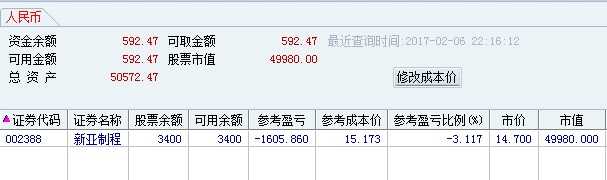
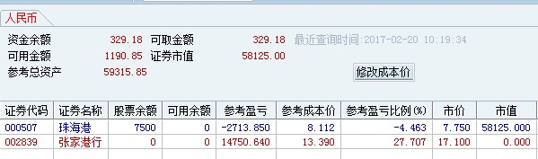
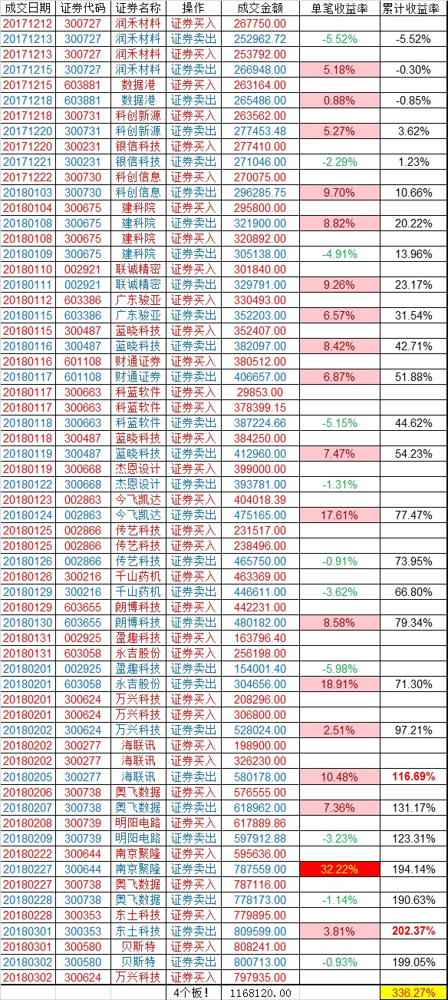
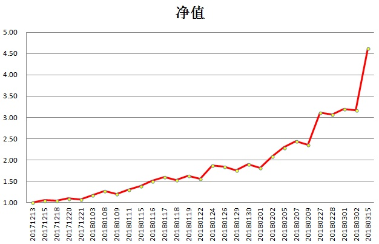

## 我和小明

注：文中小明就是另一个自己，以下皆为交易过程中自我的对话，这里按照时间序整理，可便于分析退学炒股思路的演进。

原文链接 <https://www.taoguba.com.cn/Article/1628910/1>

2017-02-06 22:22

今天跌停割完[同力水泥](https://www.taoguba.com.cn/barRedirect?stockName=同力水泥)后，我打算空仓计划明天买次新股的，下午看到[新亚制程](https://www.taoguba.com.cn/barRedirect?stockName=新亚制程)拉升3个点的时候，小明跟我说，新亚制程也是庄股，参考1月20的[利君股份](https://www.taoguba.com.cn/barRedirect?stockName=利君股份)今天肯定拉到涨停，我也是傻，二话没说就买了

---

2017-02-07 07:15

我主要模式是打板，但小明老来搅和

---

2017-02-08 17:24

小明让我不要打板，他觉得打板被砸开会亏很多，让我低吸，当天涨停就能大赚.

小明，性格懒惰，收盘之后就知道发呆混时间，然后等股票开盘，我真的看不起这样的人。职业股民时间这么多，为什么不好好把握，我自己有计划，要不断学。

我还发现他心态一点都不好，太想赚钱了

---

2017-02-09 12:54

这几天大涨，小明对我说，别人都赚钱你却踏空了，赶紧去买一个吧。我跟他说，不管其他股涨不涨，没有自己的标的就不买，瞎买一个就会使自己陷入被动，今天复盘做好计划明天出击。

今天好不容易空仓一天，下午的时候小明又想让我买，可是我实在不想买啊，原则问题要坚守。

---

2017-02-10 12:58

今天小明的内心很急躁，好像是因为踏空了，好久没有赚钱了，他感觉很着急。其实，为什么着急呢，急是赚不到钱的，反而会使自己丧失理智。

小明这几天踏空，因为他买的是庄股，买庄股完全是一种赌博行为，因为你把自己是否盈利交给了别人，这种行为具有很大的不确定性。

---

2017-02-12 21:41

这几天想了很多，发现我之前的股票都是在乱做，总想着征服市场，把所有的机会都抓住

---

2017-02-13 10:27

小明有一个难以释怀的东西，就是割完之后它涨了怎么办？
    ...
    如果你是按照你的思路去买，也按照你的计划去卖，在你的理论是正确的前提下，是不会出现割完之后上涨的情况，如果有股价上涨，那么必然是出现了一些你不可预知的因素，最常见的就是某个大资金引导股价上升，但这个是你不能掌握的，如果你不割肉赌会有大资金来拉抬股价，万一没有呢，这样持续下去只会套得更多

---

2017-02-16 08:38

人与人之间智商的差异很小，性格的差异很大，战胜不了自己，也成就不了自己。

什么是勇气？就是当你感到害怕时还坚持做下去。
什么是自制力？就是当你非常想去做有任何条件做某件事时还坚持不去做。

---

2017-02-20 10:21

早上看错了，以为二封了就买了，犯这种错误主要还是复盘没做好，以及太急了

---

2017-02-20 13:56

佛山路选股水平确实高，买的股第二天都有很高的关注度，这些突增的关注度所带来的买量足以让他从容出货。

---

2017-02-20 22:28

为什么每次赚钱后都会来一次大亏，不仅仅是只有我这个问题很多人都存在，说明这个问题绝对不是什么偶然。导致这个现象的发生很大原因是因为心态，当一个人成功一次后会增加自信心，连续成功便会自信心爆棚，对自己的判断是百分百认可，绝对不会让自己失去任何赚钱的机会，看好一个股就立马买了，如果买错了但小亏并不会让自己的信心减少多少，只有直到大亏时才会使信心大幅下降，当信心下降后，出手便会非常谨慎，开始不断思考学。

---

2017-02-21 22:21

对自己很失望，非常失望，无法战胜自己。无脸去见任何人。

第一步，放慢自己的脚步。
第二步，保持一个平和的心态。
第三步，理智思考每一个决定。
第四步，学反思提高。

我一直都明白我最大的问题是我自己，一些性格的缺陷让我成为股市中的残疾人。
我明知道该去赚哪些钱，可却妄想掌控所有，不让任何机会错过；
我明知道做一件事的风险，却去妄想会不会发生奇迹；
我明知道慢即是快的道理，却从来没有放慢过自己的脚步；
我明知道时光易逝，却从来没有让自己过得有意义。

[@退学炒股](https://www.taoguba.com.cn/blog/1035186) 其实很简单啊你在重新认真的看下口话大湿的贴。一定要从头看到尾从他发的第一篇帖子开始看起。含金量非常重每篇都是精品。养家心法就是笼统的说了一下市场情绪，而大湿的贴是教你怎么从技术方面看出主力和市场的情绪。兄如果看进去的话以后我们可以多交流一下。我也是最近才认真的研究他的贴最近操作挺不错的。比兄没头脑的操作好多了。记住一定要从头开始看你才看的进去他刚开始发的贴含金量也最高。希望能帮兄走出困境。兄看进去了我们也多交流一下我也才刚起步哈哈

---

2017-02-22 11:21

在一个买卖自由的市场里，亏钱没有谁的错，错只在自己。

人处在什么情境下最想去操作？一，看到别人都赚钱的时候，踏空心理；二，当自己连续成功之后，此时自信心十足；三，当自己大亏的时候，一心想要扳本。因此，当遇到这三种情况时需要时刻保持警醒。

最近犯了两次错，每次错都亏了10多个点，我仰天长笑，哈哈哈哈哈~~~

---

2017-02-23 22:42

股市中一些常见的偏执心理，比如抄底要抄最低点，打板要打最早板，做接力的死也要找个连板上，又如追求当天账面的盈利否则看着不舒服，不能空仓就算只买了100股也行，等等。内心对形式的偏执，就像双眼被黑布蒙住了一样，使我们看不透事物的本质。

---

2017-02-24 00:18

为什么踏空比亏钱给人的感觉更难受，从正常的逻辑来分析是不会产生这种感觉的，但实际上它却普遍存在。很多人这知道一点，亏掉10个点带来的痛苦比赚到10个点带来的喜悦要大，踏空是别人赚钱了而你没有，你认为如果你持仓了也必然会赚那么多，所以你把踏空当成是一种亏损；这种亏损与你持仓亏损的区别是，持仓亏损可能是我技不如人，而踏空并不能说明我水平差只是我没有参与。所以有这种感觉的大都是对自我认可度比较高的人。

---

2017-02-24 17:28

做股票的几大方向性错误，一买庄股，二依据技术指标操作，三听随大神专家买卖。有时候确实会赚钱，但这些都是运气成分居多，花费时间再多也不会有什么长进。

我的情绪总是处在两个极端的状态，赚钱了会极度自信，亏钱了会极度沮丧，我不想看到自己失败，亏钱对于我来说就是失败，赚钱对于我来说就是成功，一切都源于我太想证明自己，我把股票的成败当成了衡量自己人生成败的指标，是我对股票太沉迷了还是我见识的东西太少了？

----

2017-02-25 08:55

股市每天只开4个多小时，其他时间用去做什么，很多时候都是在打发时间等第二天开盘，但有的人却在利用这段时间不断学丰富自己，人与人的差距就这样慢慢拉大，十多年的股龄可能都不及别人两年的水平；刚入市的时候可能会觉得还有很多需要学，每天都过得很充实，当过一段时间之后发现股市里没有什么可学的，每天复盘完了就不知道做什么了。但实际是，我懂的只是一点皮毛，各种经济金融理论，各种行业政策发展规划，我都不了解，尽管看这些东西很枯燥，我都希望自己能抽点时间看一看。

---

2017-02-28 14:01

**打板第一要义：封死，宁可第二天低开，也不要当天回落。**

注：这应该是他打板多次的经验总结

---

2017-03-03 09:11

阻碍进步的几个常见错误：

**一 加钱，当一个人大幅亏钱后会有两种选择：反思或者加钱**

反思是你对自己行为的一种纠正，**加钱是你觉得自己的思路是对的只是一时运气不好，然而加再多钱也无事于补；**

**二只盯着自己的股票，没有去感受市场的整体气息，收盘后找一些关于持仓股票的信息来告诉自己是对的；**

**三把自己亏钱的因素归结于外界，比如要是T+0我肯定赚，这个游资不砸盘肯定涨，大盘不跌肯定涨，它涨时没看到不然我肯定买，外界的因素并非只针对自己但每个人的结局都不一样， 而你从来都不会去思考你为什么会这样**。

---

2017-03-12 22:06

**空仓，不是靠回避股市，也不是靠限制交易来达成，真正意义上的空仓是处在看着盘打开交易软件随时准备下单的状态中完成。**

---

2017-03-13 18:11

不要把自己与生俱来的东西看成是一种能力，可能这只是你比别人唯一优越的地方。人最缺少的一种能力就是去改变自己的能力。

人喜欢猜测别人的心理却怎么也弄不明白自己，当看到镜子中的你，除了相貌你对他一无所知，此时你是否会问一句他是谁？

---

2017-03-14 13:36

现在管理层明确表示新股发行节奏不会减缓，从现在来看保持每周10家的数量，随着股票数量越来越多，造成资金分流的现象是很严重的，很多个股将会无人问津，潜伏这种模式的成功率会大幅下降。而做短线的人将会集中关注市场的强势股，因此更会出现强者恒强的局面，也意味着很难出现大面积的涨停了。

---

2017-03-16 14:18

有些大盘股动不动就一天成交50亿以上，可以想象市场的资金总量是非常大的，资金总量大意味着机会也很多，但现在股票供应速度远远大于新增资金速度，这些钱都会交给大小非或者随着估值下调而消失。另外我觉得职业炒股这个职业以后会越来越难做了，特别是想从几万块的资金起家，可能利润都维持不了生活开销。

---

2017-03-17 07:29

股市中所指的天赋更多为性格，一个理想的性格状态主要包括这几点。第一失利时乐观自信，得利时不骄傲自满；第二能虚心学，不断提高自己；第三沉着冷静，不会盲目冲动；第四好胜心适中，过强则赌性太重，过弱则会失去动力。

---

2017-03-19 08:43

错了就割，千万不要抱有任何幻想，将操作和盈利分别看待，它们两者没有必然联系。操作只有对错，盈利交给市场。

为什么我们总是觉得时间过得很快？因为我们记住的东西太少了。

---

2017-03-20 08:13

人生的高度取决于格局的大小，小成可以靠运气或者耍点小聪明来实现，而大成必须是依赖一个人的格局。

这个周末，有两件事很有趣。
一，看到满屏的关于[中原证券](https://www.taoguba.com.cn/new/stockbar/barRedirect?stockName=中原证券)周一反包的帖子，被套在正常不过了，为什么能引起这么多人的讨论，这可能就是市场合力吧，持有者达成默契就是要将它吹上天；原本只是想让别人买入，可能吹久了连自己都信了。
二，[中国神华](https://www.taoguba.com.cn/new/stockbar/barRedirect?stockName=中国神华)大手笔分红，以前人们都是抨击只送股不分红的行为，现在有人分红了而且是创历史的分红，但是得到好评的并不多，主要是说大股东持股这么多不是再给自己送钱吗、分红之后股价还得减少等于没分一样；其实稍微有点远光的人都明白，这是一次可以写入中国证券史的壮举。

---

2017-03-21 17:07

不来一次大亏永远都不会怀疑自己，来来回回过山车有意思吗？这都什么时候了，连这么简单的事你都做不到，真的是狗改不了吃屎！

不要去关注别人是否赚钱，难道别人亏钱了你亏钱也是理所当然了吗？
你是谁？你是职业炒股者，养家糊口全靠你，你不赚钱难道跟着你去吃屎吗？

---

2017-03-21 19:12

**股市里有一句老生常谈的话，行情好时多做，行情差时少做，控制回撤复利增长。这个道理很多人都知道，可是没有几个人能做到，如果有人刚入市就能做到，那这是他最大的天赋。如果以此为标准给我的天赋打个分，我觉得是负分，入市三年多我空仓的日子累积不超过10天，很多时候我认为是股市不适合我，却从不觉得是我不适合股市。接下来的路很长，长得让我心凉，但我已认定，坚持下去，永远都不会放弃。**

---

2017-03-21 21:06

近期的盘面让我很困惑，涨停的个股每天40多家，给我一种盛世繁华的景象，其实除去未开板的次新股只有10多家涨停，这其中还有一半是庄股，而真正让我非常确定要下手的标的很少。遇到这种情况最好的方式就是空仓，等待时机，如果随意去买不仅赚钱概率小，还可能会错失重大机会。

---

2017-03-22 20:17

说句实在话，我觉得空仓比抓到一个涨停板更加喜悦，看到洁净的界面时心里特别舒畅

---

2017-03-24 12:04

很多人都说要有模式，只做模式。我很困惑，打板的就一定只能打板，接力的只能去接力，低吸的只能去低吸，半路的只能去半路吗？可能连我自己都弄不明白，对于我而言，要的是一个确定性，如果能确定它当天会涨停那我绝对不会在涨停去买了。

---

2017-05-04 13:29

当你还在为错失机会而痛苦不已时，说明你内心还没有做到无我的境界，无我就是屏蔽自己的主观意识情感，达到实事求是的一种状态。正确的操作并不一定会赚钱，但它确是风险最小的做法，如果因为某一次没有赚到钱从而去改变自己的做法，那这往往就会成为亏损的开始。

遇到任何事情都要保持理智，一颗清醒的头脑比什么都重要，情绪这个东西它不会替你思考后果，如果跟随情绪去做只会让自己陷入被动，有的时候后果不堪设想。

---

2017-05-11 19:45

从斗地主里想明白了一个道理，以前总是把失败归结于他人，但实际上这种情况是可能发生的，是偶然而不是必然，因为你做得并没有错，所以这种情况应该算在我们的预期之内，做好遇到它的打算然后及时处理，把损失最小化。

---

2017-05-23 08:21

为何会有大幅回撤？随机概率由三个部分组成，连续成功、连续失败以及概率匹配段，在股票之中你会经历连续成功，但使你连续成功的是外界因素而非自己，你也会经历连续失败，你也会在这次成功下次失败之间轮动，同样的方式在不同的场景下必然会导致不同的结果，因此**选择在高成功率的场景下操作是最佳**。但并非所有人都这么理性，当连续成功后自信心会大增，自信是什么？就是把小概率的事件当成是大概率事件，比如在熊市当中你连续赚钱了，会让你产生一种错觉，认为这不是熊市。自信心的消减需要连续失败来完成，连续失败必然会导致回撤，直到你保持理性为止，这个回撤点一般是上轮资金的起点。所以控制回撤有两个方法，一是随时保持理性，二是在心理层面提高回撤点。

---

2017-05-24 22:12

股市谚语，一根阳线改变信仰，这说明人的信心修复很快，这只限于一群人，对自我认可程度高的人。

---

2017-05-30 09:54

人人都期盼假期，唯独职业股民这个群体不喜欢。不管对于何种职业，假期都是一个休养生息的阶段，一个反思总结的好时机，以更好迎接未来的挑战。职业股民不喜欢假期，说明内心还是太浮躁了或赌性太重了，生活中还有很多事可以去做，这点时间真的是不够的。

---

2017-06-17 16:14

了解别人会让你知道如何赚钱，了解自己会让你知道如何不输钱。

评判职业投资是否成功的标准是结果不是过程，投资的目标就是为了收益，而不是为了体验惊险刺激的过程。

---

2017-07-03 18:03

今天去外面小摊买水果，有很多水果商贩，有固定摊位，有推三轮车的，有面包车的，有小货车的，谁会投机取巧？首先可以确定固定摊位不会，因为长期生意这次骗了就没下次了，所以投机取巧主要在移动摊位上面，但并不表示所有的移动商贩都会投机取巧，最重要的是分析他们的行为，首先从水果的种类分析，如果只卖单一品种，那么这往往是薄利多销的一个方式，因此相对而言价格便宜，投机取巧几率小，如果水果品种多，那意味着他的进货价高，为了保证利润可能会投机取巧；第二从水果的价格分析，如果价格明显低于行业平均水平且成色不是太差，那投机取巧的几率很大，因为价格太低肯定是亏本的，如果成色差可能只是甩尾货；第三从水果的计量方式分析，有按斤、按个、按包卖的等，按斤卖的可以自由挑选，因为要和店家互动较多，所以投机取巧的几率较低，按个卖的基本不会因为自主性很大，按包的几率较大，因为买家一时难以分辨。

---

2017-07-07 15:55

牛市思维对于短线资金是致命的，它会让你从主观上高估个股的强度，从而错失最佳的买卖点。牛市思维只合适做中长线的资金，它能增加持股信心，忽略小的波动，从头拿到尾。

---

2017-07-12 22:40

要学会看别人赚钱。如果一个市场没人能赚钱那必定不会有人再来参与，正是这种赚钱效应的传播才使得不断有人加入，所以必定会有一部分人是赚钱的，在牛市时这部分人占比高在熊市时这部分人占比低，因此不要妄想自己赚钱而别人都亏钱；在市场上能赚钱的有两种人，一种是靠运气一种是靠能力，运气是不能持续的，因此没必要羡慕，靠能力赚的钱更加不能眼红而应该去学别人的优点，不要去比较自己和别人赚得多还是少，一旦去比较，就会有超越别人的欲望，从而会把一种不确定性的操作从主观上认为可行，这就是赌。

理性对待他人对股票的看法。有些人买入一个股票后，弱则惶惶不安强则过度期望兴奋，不断去寻找别人关于此股的看法，看到有人说涨时内心感到很舒心，看到有人说跌时则加深焦虑，甚至要和他一辩雌雄从嘴巴上说服他人这个股明天会涨；因此对于他人关于股票的看法，只说涨跌结论的不必关注，因为对自己毫无作用，分析涨跌原因的可以参考，但这一切都得建立在自己保持一个客观态度的前期下。

---

2017-07-15 07:57

空仓等待最佳买点到来。**最佳买点应该是确定性最大的买入点**，如此下去才是复利，**很多人都等不到最佳买点就已经下手了**，当它来临时已经没有子弹了，除了懊悔遗憾就没有下文了，甚至没有长一点记性。

---

2017-07-20 00:19

埋没天赋的是懒惰，不要因为一时得利就以为将来可以高枕无忧，市场每天都在变，每天都有要学的东西。

---

2017-07-25 08:40

分仓操作是减少收益还是减少风险？所有的模式都会有成功率，连吃5个跌停再连吃5个涨停后的资金是小于原点的，分仓就是为了防止连续失败后的大幅回撤。它会减少单个票的收益，但不会减少总体收益，因为机会不止一个。

---

2017-08-09 11:56

人在什么时候容易失去理性判断？当你看好某个方向，出现某些东西支持这个方向时，会加强你对这个方向的态度。比如你看好某个股，但你不是非常确定，当看到有人说这个票好时或者当盘面走势很强时会使你更加认同此股，但实际上这些东西并没有改变这个事物的本质，所有的股票必然有人持有，那必然会有人看好，否则就不会持有，盘面的走势强度的持续性也是不确定的，不能一强你就看好它一弱就否定它。

大概率小收益和小概率大收益哪个更加适合股市？大概率小收益是以保证本金为首的模式，意味着出手频率减少，短期而言可能收益很低，但以长时间来看不断复利后增长率是很高的，这可能比较适合较大的资金。小概率大收益是以快速增长为首的模式，意味着短期收益很高，这适合小资金实现快速增长，但过程随机性太强，运气不好时可能大幅回撤。

不要让这次的操作影响你下次的情绪。可能这次操作你做得不够好，内心会沮丧、痛苦、自责、懊恼，出现这些情绪都是很正常的，但此时不能让这些情绪主导你的大脑，因为这些情绪都会影响你下次的判断，当遇到一模一样的情况时你内心会退缩，或许你会为了挽回局面而急于操作，正确的做法是思考你这次做得不够好的原因，下次改进；当你这次操作得好时，你会兴奋，信心大增，遇到事情时你的主观性会更强，你认为对的东西你会更加肯定，这就是典型的盲目自信，只有当你遭遇失败时才会浇灭你的自信心时，但此时资金已经大幅回撤了。所以把每一次操作后的情绪分开，当下一次操作开始时你的情绪应该是要平淡的。

---

2017-08-10 11:16

盈利不分贵贱。赚同样的钱，在牛股上赚的比在普通股票上赚的更有面子，打板赚的比低吸赚的更有成就感，所以有时候会为了买入牛股而放弃自己较为确定的标的，或者为了打板而打板。本质上这些都是一样的都是为了盈利，我们不应拘泥于形式上的区别，盈利不分贵贱。

忘掉每一次交易的盈亏。你的交易应该是按照你的系统来的，而不是随着情绪买入或者卖出，只有新手才会干出这种事，如果你是新手那就应该从改变这一点做起；可能你买入之后它跌了，你可能会说要是我买了另一个股就不会这样了，或者卖掉之后它涨了，你可能会说如果我不卖那能赚得更多，所以往往会被这些想法影响自己的心情，从而导致下次操作时你会心存侥幸，买入你系统之外的股或者达到卖点时没有卖。

不可吃着碗里看着锅里。很多时候当一个新标的达到买点时，上次买入的还没达到卖点就提前卖出去买入新标的，因为你觉得新标的能比这次的赚得更多，结果很多时候是两面受气，已经卖的继续涨新买的亏钱了；上次买入的标的它具有一个很重要的性质，那就是主动权，因为你随时可以卖出，而今天新买的从交易来上说已经陷入被动了。所以先把每一次的交易做好，在考虑其他的标的，机会很多，不要以为错过了就没有了，如果这次做错了，那得需要两次正确的操作才能弥补上次提前卖出的损失。

---

2017-08-10 22:03

为什么人的天性是懒的？这是因为在人类长期的进化中食物是难获取的，所以会以形式来保存能量，减少运动就是其中之一，有些动物在冬季来临更加难以获得食物，这些动物都选择了冬眠来度过，虽然人类没有冬眠，但在冬季的睡眠时间是要比夏季多的，所以说懒在当时来说是一种优势。随着科技和生活质量的提高食物成为了一个极容易获得的东西，每个人都不会挨饿，懒这一天性对人类来说已经是一个劣势了。懒虽是天性，但人有很强的自我意识支配能力，所以懒是可以主观去改变。

---

2017-08-11 09:08

为什么知行合一很难？这主要是对行所带来的结果没有深刻的认识。人人都知道吸毒吸烟有害健康，却很少有人因为知道这一点而去戒除，这是因为他们没有感受到戒除所带来的益处，换句话说也就是他们没有深刻体会到不戒除所带来的后果；生命都有一种适应环境的能力，活在当下是一种天性，大部分人是不会考虑长期后的事，当恶果越来越靠自己时才会感觉到危机感，但此刻为时已晚，很多事人生没有试错的机会。也有一些事能有很多试错的机会，当不断体会到痛苦后，在这件事上就会慢慢变得知行合一，当忘记痛苦时可能又会随心所欲。

---

2017-08-12 22:46

为什么很多人喜欢满仓一个股？偶尔满仓一个股，那是因为他对这个股的高度认可。每次都满仓一个股那这是一种赌性；想一次爆赚，这是贪婪的表现；靠赌来快速实现增值，这是急功近利的表现；这类人由最原始的赌性驱动，他们只想获得当下最近的利益，称之为低级赌徒。高级赌徒在于目光长远，他们追求的是长期的利益。

---

[石佛心](https://www.taoguba.com.cn/blog/2040631) 2017-08-12 23:21

你很有潜质，因为你非常爱思考并且很执着，你会成功的。

你告诉我你入市几年了，我可以告诉你多久可以成功，也就是可以持续的赢钱。

我2013年入市，到现在接近4年时间，入市一年后就处在一直盈利的状态，可能刚好是牛市的原因；当时用2000块配资1W炒股，没有想着要去积累本金，盈利多少就花费多少，这个状态持续到大三，股灾直接爆仓，后来拿着大四的学费退学了。我可能有很多种方法去弄到资金一边读书一边炒股，但我没有，一是因为家里没钱，二是我不想去借钱，我父亲当初为了在盖房子借了不少钱，后来他突然去世，留下这些债务只能我们去偿还。所以我对自己的要求就是做任何事都只能自己承担后果，决不能拖累家人。最坏的结果就是我这个人消失了，那就当我妈没有生过我，我弟弟还可以去照顾她，如果我这人消失了不仅没有回报养育之恩且还给他们留下债务让他们去承受，这是对他们极大的不公平。所以，做任何事的前提是自己关心的人生活不会因为自己的失败而变差但会因为自己的成功而变得更好。

---

2017-08-13 10:08

为什么有些人时间比他人用得多效果却不如别人？一是方向问题，如果朝着一个错误的方向用功，那都是徒劳的，所以首先要思考自己的方向是否正确，有一个简单的方法，就是看你这个方向是否有人成功过比率如何，对于普通人来说你不要妄想自己会成为历史上的第一人。二是效率问题，可能是你的天赋不如他们，天赋会使你在这个方面学得更快运用得更好，所以在相同的时间内取得的效果是不一样的，在越顶尖的领域天赋越重要，普通人就不用去参与了，比如世界冠军、歌唱比赛、诺贝尔；也可能是你不够专心，有些人喜欢在干这件事的时候同时干着另一见事，人是无法同时思考两个方向的，两件事相互干扰，会使两件事都干得不好，不够专心的原因可能是自己对这件事兴趣不足或者重视程度不够或者耐心不够。

---

2017-08-14 20:48

为什么有的人总管不住手？只要当他有资金时就会想着去操作，从来不会管环境如何，这类人的好胜心太强，这种好胜心源于对自己的高度认可。他们很少去提高自己，因为觉得自己已经很厉害了，他们只在意事情成败的结果，成功了是自己的能力，会让他们更加膨胀，失败了是自己的运气不好，然后继续一意孤行。他们很少承认别人比自己优秀，也不愿意相信别人比自己优秀，而事实上有很多人比他们优秀，当遇到一个比他们优秀的人时他们会冷嘲热讽一句，这种欺骗自己的行为只是为了掩饰自己内心的自卑情绪。管住手，实际上是控制自己的心，要学会承认自己的不足，要学会看着别人赚钱，要明白世界上自己所能掌握的事很少，最关键的是要明白，你无须要求自己完美，人生仍会精彩。

---

2017-08-16 18:06

我觉得自己的心态已经在进步了，现在不会因为踏空而痛苦，我很喜欢看着别人的股票涨停，很精彩，就像是看一场电影一样。但有的时候自己还是控制不住手，尽管我很谨慎了，但心魔总是会寻找一个机会控制我，让我失去理智，这提醒我任何时候都不能放松警惕。我潜意识里还是喜欢全仓一个股，还是喜欢爆赚，还是喜欢去赌，但这不是我乐见的状态，全仓一个股，赚了我会非常高兴，亏了我会非常痛苦，这是对自己的一场精神折磨；半仓操作时，我心态非常平稳，不会过分期望，不会过分担忧，不会过分焦虑，这才是我操作时应该具备的心态，以后坚决半仓操作。

---

2017-08-16 22:17

股票操作要小目标还是大目标？小目标是短期内且较为容易实现的目标，大目标就是长期后要实现的目标，也可以称之为理想，现在要达到它很难。在操作中，很多人把小目标的内容变成了大目标，比如一年10倍，一个月50%等，这样就是追求在短期内实现理想，毋庸置疑，这是非常难的，反映到实际操作中就会出现急切的心理，不会放过任何操作的机会。但是作为职业炒股者，一定要有理想，它是职业道路的指明灯，在迷茫的时候指引你前行。

我也订一个小目标，到年底还有5个多月的时间，实现翻倍，资金达到25万。

---

2017-08-25 22:09

独立思维的重要性。独立思维是一个以自我中心的思考方式，人类文明的发展在于交流，语言、文字、书籍等这些都是人类交流的方式，如果人人都具备很强的独立思维那么人与人之间就难以交流也不会进步，所以这也注定了大部分人的独立思维是较弱的，他们的认知都是从他人中学来。少数具备很强独立思维的人，有一部分人自我满足他们就会变得不思进取，另一部分人不会自我满足，他们会吸收别人的知识并不断思考创新，这些人就成了社会发展前进的力量。

---

2017-08-25 22:33

不要把自我麻痹当成是心态好。有的人亏多了就不会对亏损产生任何不快的感觉了，这是适应性的表现，人的大脑中有一种调节机制，它会让人更好地适应新的环境，也可以说是自我麻痹。很多情况下这种自我麻痹是有益处的，比如遇到搬家、亲人去世、事业失败等这些情况时，如果人没有这种自我麻痹的机制，那么就会一直处于焦虑或者痛苦的状态之中，相当一部分自杀的人就是因为自我麻痹机制太弱了。有的人自我麻痹能力太强，他们就容易安于现状，容易接受自己的失败，他们没有很强的动力要去改变现状，水平自然难以提高

---

2017-08-26 09:50

借钱不适用于短线操作。一是短线操作本身就是高风险高收益的方式，水平到位资金增长是很快的，如果再去加大资金，那么风险和收益两者都会同时放大，这是相当于拿了一把刀架在自己脖子上；二是在操作的时候心态会把控不好，会畏首畏尾，买完之后会处于紧张担忧的状态之中，这是对自己的精神折磨；三是大部分人不知道收手，不要妄想自己赚了之后就还钱，这是不可能的，因为赚钱之后的那种自信会让预期和目标放得更大，不继续追加资金就已经不错了，但很多时候赚钱只是一时运气。

---

2017-08-26 22:23

我有一个理想，我想让世界和平充满爱，我要努力赚钱，把钱奖励给那些正义的人，正义是勇气、公正、正直、道德融为一体，这类人在世界上的比例只有0.2%，太少了；我要让这类人的比例上升，目前我能想到的方式就是通过金钱来改变人们的观念，我会成立一个正义基金，给那些为正义献身的人奖励1000W，让他们不再担心自己的家人会没人照顾，勇敢的去捍卫正义，给社会带来正能量。

---

2017-08-27 19:14

时间是有价值的，要衡量自己的时间到底值多少钱，再来确定做一件事值不值得，比如你会利用空闲时间去做兼职吗，兼职的价格是多少，这些一般人心理都会有个预期价位，低于这个价位就不会去做了。可是很多时候人们却做出自相矛盾的事，比如要买一个东西，这个东西一般卖120元，而你曾经在某个地方看到这个东西卖100元，于是为了找到这家店花费了半天时间只为了省20块，如果你用这半天时间去做其他的活肯定不止赚20块。前者是为别人花费时间，后者是为自己花费时间，这些时间本质上都是为了金钱，但人们往往不会计较后者所用时间的价值，造成这两者的区别是什么？这里有一个自我满足的过程，人具备天生的好胜心，好胜心是为了提高社会地位的竞争服务的，后者的行为更加能体现出自己的价值，一种对自己认可的价值。

---

2017-08-27 20:25

卖错之后的盲目纠错。很多人卖掉一个股之后它上涨了，结果意识到自己卖错了然后又去追回来，但此时的买点是你的最佳买点吗？如果换成是其他股，你肯定不会选择在这个位置买入，而仅仅是因为它是你卖掉之后的股你就改变了自己的看法。很多时候，对于自己卖掉的股一直过过不忘，怕它涨，一涨就会后悔当初卖早了，如果跌了就庆幸自己卖对了。这是因为人不喜欢看到自己的失败，就像不想看到有人说自己坏话一样。如果卖错了，我们应该反思卖错的原因，而不是进行盲目的补救。

---

2017-08-27 22:02

观众是一把双刃剑。不管是比赛还是实盘，时间久了总会吸引不少人的关注，当有人关注时，内心会渴望得到他人的认可。所以一般会有两种效果，一种是从此开始变得谨慎，对买卖要求更加严格，成功率不断提高；另一种是急于证明自己，不会放过每一次能盈利的机会，出手频率变高急买急卖，这样的状态肯定不会稳定盈利，心态开始变差，形成恶性循环。所以首先要明白自己实盘是为了什么，是为了他人的崇拜还是为了证明自己能赢？如果是为了他人的崇拜那就要知道人们会接受一个短暂的失意但不会容忍长久的失败，人都是渴望正能量的，这是对人的一种激励和温暖，如果是为了证明自己能赢，那就主动把观众的评价屏蔽掉，因为你需要面对的只是你自己

---

2017-08-30 08:55

培养一种能赚钱的感觉。**有没有过这种经历，当你看到某个走势时你内心非常会确定它会涨**，而经过统计这种情况下买入的成功率非常高，这种感觉就是经验，要做的就是等待这种情况出现时再买，经验越丰富，越会有很多种情况会出现这种感觉，**比如前一天巨量烂板次日开盘走强、新龙头卡位、超预期加速板等这些情况买入时成功率是很高的**。在刚开始时这种感觉出现的频率会很低，很多人没有耐心等到这种感觉出现时就买了，当感觉来临时已经没钱买入了，结果就错失了对这种感觉的培养。

---

2017-08-30 10:28

水平提升只能通过更多的交易次数达到是一种误解。这是对自己赌性重的一种借口，水平的提升在于反思总结，而不是机械的操作，虽然每一次操作可能都会加深对此次操作时情境的印象，但要达到这个效果也可以用其他更高效的方式，一是盘中眼观八方不能只盯着自己已买的股票，二是进行更加仔细的复盘。交易频率越高越会加强自己的赌性，更加在意交易成败的结果，从而忽略提升自己水平的关键。

---

2017-08-31 20:48

这里我想问一下，何为系统，何为模式？论坛里的大神都说这是自己系统内的，模式内的，含糊其辞，当一个个股出现买点，你是如果切入的？模式二字困扰我很久，模式是低吸？打板？半路？望兄不吝解答！[@退学炒股](https://www.taoguba.com.cn/user/blog/atname?n=退学炒股)

系统是根据经验对买卖点设定的要求，具体内容可能每个人的都不一样，它的作用就是让你去做自己最拿手的事，不再临时起意情绪用事；

---

2017-08-31 20:59

人的天性非常难以改变。就拿恐惧来说，人天生对某些事物恐惧，恐惧这种感觉对人是有益的，它能让你什么东西会有危险然后远离它，提高生存几率，比如恐高症，如果人对高度不恐惧，那么就会经常有人摔死。恐高是人的天性，当你站在摩天大楼内隔着玻璃向下望时，如果自己不去主动控制意识的话站得越久恐惧感会越强烈，你会害怕玻璃碎了、会害怕有人从背后推你、会害怕大楼突然倒塌，而事实上这些情况根本不会发生，当你走下楼时你也能明白这点，但身处其镜时便完全失去了理智。天性对人的控制力太强了，但只要自己意志坚定是可以克服天性的。

---

2017-09-07 23:18

我现在应该保持一个什么样的心态？这几个月资金得到了快速增长，金钱上的压力减少了很多，曾经靠一包榨菜一个鸡蛋一碗米饭度日的生活不会再出现了。但我和别人不同的是，别人操作的资金只是家庭总资产的一部分，而我是全部家当，所以我很难像别人一样漠视股票的盈亏，我可能会注重操作的盈亏结果，这个是心态的大忌，我这几个月从来没有因为赚钱了而睡个好觉，恰恰相反，我失眠更加严重，精神接近崩溃，这样的状态让我无比痛苦。我知道怎么解决这种状况，那就是分仓操作，可是我潜意识里非常抗拒分仓，产生这个想法的原因是对自己太认可、太急功近利，我认为这次肯定会赚，所以我必须打满，不打满就好比亏钱了。如果要全仓操作，我想问自己几个问题。

一，如果停牌了怎么办？
我从来没有想过自己的股票会停牌，我觉得这不会发生在我身上。事实上，如果停牌了，我将没有任何资金可以操作。
二，你愿意承受连续失败之后造成的大幅回撤吗？
不愿意，但我觉得这种可能性很小。事实上，这种情况发生的概率很大，抛硬币时连续5次出现同一面的情况常有发生，资金回撤50%需要盈利100%才能回到原点，发生这种情况除了扰乱心态之外，还会浪费很多时间。
三，当有一个更好的标的出现时你会马上卖了去买吗，如果去，你愿意承受左右打脸的结局吗，如果不去，你会为错失机会而遗憾吗？
以前可能会去，现在很少了，错过了会有遗憾。有遗憾就说明了内心的不甘心，觉得这原本能赚的钱却没赚到，可能会为了挽回局面而进行随意操作，这是一种不良心态，而解决这一局面的方法就是分仓。
四，你当天买入的股票被套，而之后出现很多机会可是你却没资金买入了，你内心会有什么感想？
会懊恼。解决方法，分仓。
五，除了自身原因外，还有什么因素促使你要全仓操作？
因为我看到很多高手都是全仓打板一个股，所以我觉得要成为高手应该也是全仓买入一个股，另外一个我觉得股票太多了可能会忙不过来。事实上是不是高手与分仓和全仓毫无关联，这是我在新手时期造成的一种误解，这个误解没有消除就形成了一种记性，记性慢慢就变成了定性思维；至于忙不过来，短线操作两个票绝对没有一点问题。
六，操作时你能保持一种客观态度吗？
比较难，常常会失去理智。全仓操作单个票的盈利大，亏损大，适用于成功率非常高的股票，分仓单个票的盈利小，风险分摊，适用于较高成功率的股，所以全仓还是分仓在于买入标的的确定性有多大，而高成功率的标的是很少出现的，每天满仓必然是错误的；无法保持一种客观态度，从主观上增加成功率，这是好胜心、自信心过重导致的，除了调节自己的主观情绪外，还要加深对成功率的判断能力。
七，全仓操作是如何影响我生活的？
因为这是我的全部家当，所以我必定会重视它，一是我担心它会出现什么意外，二是我会满心期待，所以我的情绪就徘徊在焦虑和期待之中，这两种情绪都会使肾上腺激素上升，心跳加快，所以很难睡个安稳觉，而一旦睡眠不好各种问题就会接触而来，思维能力、工作效率、精力大幅下降，情绪焦躁和低落，白天黑夜颠倒，失去正常生活节奏，与人交往过少，便会产生孤独感，久而久之可能会对生活失去欲望。

---

2017-09-09 08:49

我找到了适合自己的持仓方式，设置一个回撤线，资金在回撤线之上则全仓，资金到了回撤线则分仓，回撤线根据资金最高点变动，大概10个点左右的幅度。这样既能保证攻击性又能防止大幅回撤，这是比较符合我性格的一个方式。

---

2017-09-09 12:32

现在欧尚开始完全实现生鲜区自助称重了，欧尚对外宣传追求自由，其实上是一个伪君子，因为生鲜商品的价格普遍比其他超市贵20~30%，这贵的部分就是考虑了人为损耗的成本，这会导致什么严重的后果，因为会促使很多人进行投机取巧，目前投机取巧的方式主要有两种，一种是按便宜的物品称重，另一种是称好之后再去加一些进来，所以欧尚的这种做法会使守规矩的人吃亏，去为不守规矩的人买单，欧尚这种垃圾做法助长了社会的不良风气。再看一个，共享单车刚出来的时候人为损耗率非常高，现在开始逐步下降，而他们的价格始终保持不变，因为公司主动承担亏损。为什么这两者会有区别？因为很多人是徘徊在道德和自利之间的，他们感到迷茫，没有坚定的信念，需要引导，所以人很容易跟风。欧尚提价，会让很多人感到吃亏，在一个具有鲜明阶级分明的社会之中大部分人是不会愿意吃亏的，吃亏就代表不如他人，丢失尊严，所以当看到别人投机取巧之后便也进行投机取巧，结果就是干这种事的人越来越多。而共享单车它的价格本身就处于合理价位，当看到其他人投机取巧时觉得吃亏的感觉并不强烈，所以不会做出同样的行为，因为大部分坚守原则，会促使那些投机取巧的人感到道德谴责，于是开始遵守规则。

---

2017-09-13 08:13

“牛市来了”这句话是短线的毒药。市场上有那么一群人他们喜欢熊市，因为熊市强势个股较少，一览无余，很清楚自己要做什么，而牛市满屏的涨停板，鱼目混珠，没用明确的目标，犯错的几率反而大。另一个，当你知道这是牛市时你会放大的自己收益预期，觉得一个月至少赚30%才得起牛市，而赚得少则会产生低落情绪，随意操作盲目换股就来了，熊市则会放低的自己预期，出手更加谨慎，就算偶尔亏损也不会影响自己的心态。短线，牛市与熊市的区别是，牛市机会多熊市机会少，确定性与牛熊无关，对于每天全仓操作的人来说那更加没有关系了，不管牛熊基本每天都有机会可以操作，所以一天10个机会跟一天一个机会没有区别。

---

2017-09-19 17:55

非常感谢大家的关注，你们的回帖和站内信我可以保证每条都看过，但我回复的比较少，如果没有回复到你，可能会产生一些失落的情绪，也可能会认为我在装清高、耍大牌，有这种感觉很正常。但事实不是这样的，很多问题帖子里都讲过，仔细看看就知道了；从给我的信息来看，主要有以下这几种。一是要单独学交流或者拜师的，这篇帖子就是我的全部感悟，所以就算我给你联系方式，我要讲的也还是这些，真的没有什么秘籍。二是要我代为操作、实时带操作的，这是一个方向性错误，我帮得了一时帮不了一世，最好不要找捷径。三是一些涉及具体个股和操作问题的，个股信息除了内幕没有什么是你找不到的，操作上如果有亮点的话我会和大家分享的。四是一些夸奖、提建议的回复，非常感谢你们的信任，我会认真听取建议。

---

2017-09-19 18:51

人为什么会幸灾乐祸？当看到和自己有社会比较的人遇到倒霉事时，很容易产生幸灾乐祸的思想，社会比较的对象一般具有相似、相近、相熟的特征，股民之间就是对收益的比较，且这个比较很明显，所以有些人看到别人亏钱了、跌停了、停牌了会感到高兴。幸灾乐祸就是为了获得一种自我满足的感觉，能力越低、自尊心越强的人越容易产生这种感觉。幸灾乐祸会产生自我麻痹的危害，在竞争中要想赢，有两个方式可以达到，自己进步或者别人退步，遇到倒霉事这是别人的一种退步，如果此时自我满足了就会使得自己的进取心消退，这是一件损人不利己的事。

---

2017-09-22 15:29

人为什么会感觉痛苦？心理的痛苦来源于现实与期望值之间的落差，落差越大痛苦越大。期望值是指你能实现目标的心理预估概率大小，比如很多人都有要成为世界首富的想法，但没有实现也不会给他带来多少痛苦，因为他对这个目标的期望值极低；期望值一般由环境决定，大脑会自动选择一些和自身具有可比性的参照物来衡量，这个过程是在不知不觉发生的。亏钱了就一定会痛苦？不一定，在大盘暴跌的环境下，他对赚钱的期望值会降低，所以不会产生多少落差，也不会带来多少痛苦。同理赚钱了也不一定会高兴，如果自选股全部涨停而他只涨了两个点，这种环境决定了他的期望值会很高，赚的这点钱低于期望值，所以也会带来痛苦。有些情况下期望值会很高，比如因为某种原因错失了目标股，而目标股大涨，此时你达成目标的心理概率接近于100%，就会产生极大的落差值

---

2017-10-10 00:00

不要过多地关注别人的交易。一是别人的交割单毫无用处，因为你不知道当时他为什么要买为什么要卖，如果只是按照图形技术指标来操作的话，那完全脱离了正轨；二是别人的实盘会扰乱自己的心态，如果别人赚钱了可能会打击你的自信心或者增加急迫的心态，如果别人亏钱了可能会让你产生幸灾乐祸自我安慰的心理，从而使进取心减退或者对亏损产生麻痹，严重的就是，别人赚钱的时候你跟不上，亏钱的时候你跟上了。**别人的言语不管说得对不对都可以看可以听，看多了总会遇到那么一句能点醒自己的话，但交易应该独立思考**。

---

2017-10-10 00:10

这段时间我的状态一直很轻松，对股票没有很在意，睡得也很香。另外实行了分仓操作，其中一半停牌了，玩多了总是躲不了的，庆幸的是只是异动停牌，不过这也说明了分仓的重要性和必要性，下次可能就是重大事项停牌了。

---

2017-10-11 21:53

很多人写信让我代为操作，这个忙我帮不了，原因如下。第一，我的水平有限，我也不敢保证将来一定会赚，不少人是大亏了很多然后想要回本即可，那我推荐你们去做中长线，想要提高中长线水平可以多看看研报，论坛里做得比较好的有吾知讲乜，可以多去看看他的发言；第二，我不想看到不劳而获的现象发生，不劳而获是对社会公平的践踏，“一人得道,鸡犬升天”这是普遍现象，我改变不了别人的想法，但我不会让它在我的身上发生；第三，我对你们不了解，不知道你们赚了钱之后会拿去做什么，我想大部分人都是利己主义者，有了钱之后办事找捷径、胡乱消费，增加社会的不良风气，那我就犯了大错了。

也许有人会说我太把自己当回事了，那你可能就忽略了一点，社会是由一个个人组成的，你的一个微不足道的动作可能都会对这个群体产生很大的影响，就像一群人在过马路时，如果有人带头闯红灯，那么后面就会源源不断地有人跟着闯，而那个等着绿灯到了才走的人可能会被当成怪胎，这个想法就是一个畸形想法，事后很多人都明白这个想法不对，但在那时他们确实把那个等绿灯的人当成了怪胎。所以不管别人怎么说，我会坚守我的原则。

---

2017-10-21 07:40

职业初期水平下降的错觉。不少人觉得自己能稳定盈利后辞职在家炒股，结果收益反而不如辞职之前，甚至感到迷茫，这主要是因为无效交易做得太多。职业之后时间多了，对复盘、信息收集、盯盘会更加充分，可选标的会比之前多了很多，但这些标的很多是有瑕疵的，特别是临盘选股容易一时冲动；另外职业炒股这个身份也会促使人去频繁操作，没有了工作收入对股市盈利预期大幅提高，而要想盈利只能去操作。

---

2017-11-05 00:26

实盘帖我决定终止，因为没有存在的意义了，起初我的目的是为了记录自己，证明自己，但随着影响力越来越大，它的副作用慢慢突显出来了。非常感谢那些关心、尊重、信任我的人，这篇帖子希望能好好看，可能有说得不对的地方大家取其精华去其糟粕，结合自己的性格，不断了解自己、优化自己，慢慢地就会发现自己适合做什么，擅长做什么。

---

2017-11-12 10:32

为什么同等数额在生活中损失会比在股票上的损失感觉要强烈？这是因为对手迷糊化，在股票上不知道自己的对手是谁，不清楚损失的钱是被谁赚走了，无法与对手产生比较，所以就不会使自己的自尊心受挫；二是亏损占比小，因为有跌停板限制，一天亏损的钱占比有限，有的人可能累计亏损90%了，但这是一个漫长的过程，有充分的时间使自己调节适应接受现状。

---

2017-11-17 16:33

今天在颐和园打开手机一看股票竟然跌停了，账户亏损10个点，这个损失其实我是可以规避的，但我犯了几个错。首先从上周日特停公告说起，当时公告出来后，我预计至少会停三天，于是我向XF提议去[迪士尼](https://www.taoguba.com.cn/new/stockbar/barRedirect?stockName=迪士尼)玩这样周三晚上可以回来，但她说上海天气不好，想去北京玩，我知道去北京肯定得花一个礼拜左右，我内心是不想去的，但想想看好像又不会产生什么严重后果，于是带着电脑周一来了北京；周三晚上出了复牌公告，第二天中午我们没有去玩，就呆在酒店看盘，可能是我对这个股过于看好，所以那天根本没有想卖出的意愿，因为我觉得这个股还能涨，于是下午我们就去出去玩了；到了今天周五，我内心仍然看好它，直接锁仓不卖，起床之后就去颐和园了，结果事与愿违。这次亏损我不会去怪监管层特停，这个规矩并不是针对我个人的，我有解决办法那就是分仓，但我没有，所以是我的错；我不会去怪XF要来北京玩，她并没有强迫我来，如果我不想来我可以明确拒绝，但我没有，所以是我的错；我不会去怪大盘不好，大盘不好时只要空仓即可，但我没有，所以是我的错。就算上面的情况全部没有发生我可能还是会亏损，因为这些天我清晰地看到了小明。

---

2017-12-10 17:03

XF是一个没有安全感的人，每次亏钱和花钱的时候她总是充满了对未来的担忧，我对她说最艰难的时期已经过去了，她现在辞职专心考研，但她时时刻刻担心着我在股票上会重蹈覆辙，再次变得一无所有，为了让她安心，我往她的账号转了20W。我是一个向前看的人，不会去计较过去受了多少苦，我只在意将来能不能做得更好，现在我内心坚定，未来会一片光明。

在我越来越接近股市真相的时候，我的睡眠也越来越好，已经很久没有失过眠了，对股票我已经不在担心，现在我开始去理解和体会生活，人和事也变得越来越简单，他们不知道自己为什么要这么做，但却都在做着同样的事。我觉得，世界上没有什么事情是嘴巴搞不定的。

---

2017-12-20 15:57

自从分了两个账户操作后没有想要过空仓的欲望了，以前全仓一个股的时候根本接受不了像跌停、黑天鹅、停牌这些情况，现在基本不用担心了。行情不好的时候完全空仓？对我来说，这是不存在的，以前因为配资而破产的时候，当时很多人劝我先去找一份工作，我没有去，东拼西凑弄到一万块继续操作，我当时给自己的理由是，去工作最多只能拿到3000块的工资，如果每个月能赚30个点，那就没必要去工作了。我对股市仍然充满信心。

---

2017-12-28 11:29

买卖不一的问题。中线买短线卖，有的人看好一个股，觉得可以拿几个月，可是第二天一走弱就怀疑自己是不是看错了或者觉得太慢了想去做短线，然后卖掉之后看着它一路涨上去；短线买中线卖，本来买进这个股是进去做个隔日套利的，后来觉得这个股很有牛股气息或者还没等到冲高就被套了，于是想多拿一会，结果越走越低，套得越多就越不舍得卖掉了。

---

2017-12-28 14:23

对牛股的态度。不应该去过分羡慕那些能把牛股从头拿到尾的人，他们既然能一路持有牛股，那么更有可能一路持有一个下跌的股，因为牛股的个数远远少于下跌的股票；如果有一些人平时能及时换股，而买到牛股后却一路持有，那这类人更不能去羡慕了，羡慕他人则有可能产生模仿的意识，只能去佩服，佩服他人则是从内心认为自己能力不足，做自己能力范围的事不是很重要吗？可惜，世界上眼红的人远比羡慕佩服的人多，眼红的心态对做股票是大忌，眼红更希望别人是遭遇不幸，而不是去提高自己来超越他人，如果无法让别人遭遇不幸，那么就会采取极端的行为来超越他人，这些行为一般都是带有很大风险性和非理性的，体现在股票上就是加杠杆、加快交易频率、极小概率博大收益。

---

2018-02-06 08:16

关于我的疑问有很多，而最大的疑问就是我为什么不去解释这些疑问，解释是为了什么，是向人证明我有多厉害吗？人与人之间一直都在比较，我要求自己不能去参与这种比较，有钱有权就应该高人一等，没钱没权的人就应该低头折腰吗？就算马云和*站到我面前，我也不应该有丝毫紧张，丝毫胆怯，我和他们是平等的，钱跟权无法去衡量人的价值。我用来衡量一个人的价值的标准是品质，社会上缺少优良的品质，如果有人问我一个英雄的命和一万个小人的命哪个重要？我可以迅速地回答，世界上可以没有小人，但不能没有英雄。

---

2018-02-09 10:48

喜欢抄底是表现出了贪婪还是知足？抄底因为买入价位低，会给人一种向下空间很小向上空间很大的感觉，如果是为了向下空间很小的感觉去买入，那是以减少亏损为优先考虑，喜欢一种安全的感觉，这是知足的表现。如果是为了博取向上空间，把利润最大化设为优先考虑，这是贪婪的表现。在股市中，贪婪与知足没有褒贬之分，贪婪的人可以追求得更高，但可能死得更早，知足的人可以活得更久，但可能一生碌碌无为。

---

我对自己近期的状态很不满意，不是赚多赚少的问题，而是因为我违背了自己内心所期望的，每天操作、满仓一个，这很明显是在求快，而我非常清楚地知道，越快会摔得越惨。我为什么会求快？有三个原因。
第一是对盈利没有明确的目标，赚得越多越好可能是我现在唯一的目的，这会促使我不断地去交易、抓住每一个能盈利的机会；在股市上我应该取得什么成就？很久以前我就在想这个问题，但一直没有答案，买房买车、赚到一个亿、成为一方游资这是众多股民所定下的目标，但稍微往后一想，我就会陷入下一个循环，实现这些目标之后呢下一个是什么？或许是因为我现在太膨胀太自信了，在当初处于长期亏损时，股市对我而言只是一份工作，每个月赚个几千块就能满足，又或许是因为超过生活基本所需后的金钱对我而言找不到区别，就像玩斗地主一样，几十万欢乐豆跟几十亿欢乐豆我真的找不出有什么区别，但内心却期盼着它越多越好。

第二是环境影响，股吧论坛里做多气氛太浓厚，让人感觉不到现在正处在高度危险的熊市之中，几乎每天都能看到打板大肉的人，这造成了一种虚假繁荣的现象，这种现象提高了人们的收益预期、降低了风险意识；当我远离论坛的时候，这种影响会减少很多，但是我不想逃避这个问题，一旦逃避它永远都会在我内心存在，我曾经问过自己，当全世界的人都去吃屎的时候我会不会跟着去吃？当我第一次问自己的时候，我真的很难肯定地回答说不去。很少有人能够在人群中做到完全独立，但我要求自己要做到。

第三是想维持自己在他人心中的美好形象，因为我已经被大众定义为“高手”，为了维持这一形象，使得我要去表现出最好的自己，保持一个最快的盈利速度、做出最完美的操作；为什么我们这么在意他人的眼光，这是人类群居物种性质决定的，群体的评价是形成道德的基础，不符合社会道德的人会受到排斥，被驱赶，他的基因也不会传递下来，直到现在，几乎所有人都会在意别人的眼光，获得他人的认同，以满足自己在社会上的归属需要。当我意识到这个问题的时候，我要求自己不要去理会别人的看法，做一个真实的自己。

---

2018-03-14 21:47

性格控制与股票技术。股票技术可以通过一段时间学学会，入市一年基本都会懂点，懂了一点心中就有了一个较为确定的买点，如果只买这个点，那么赢钱的几率很大，但是很少有人会做到只买这个点，这个点没出现时就会买入其它不懂的点，接着把赚来的钱给亏掉，这就是回撤。所以性格控制的重要性就显现出来了，你能控制自己只能在这个点买入吗？后面随着技术的深入与扩展，就会出现很多点，不用等太久就会出现了，总体的成功率就高了。这是大部分人都可以做到的。

---

[三峡浪子](https://www.taoguba.com.cn/blog/7373)

2018-03-15 10:13

退学炒股操作：

净值曲线：

---

2018-09-12 19:04

至4月份起心态就开始乱了，对应的就是资金始终突破不了，破了300W又马上跌回来，这样来来回回有五次，这次跌破了我的回撤底线。历经5个月我才意识到了自己的一些问题，我的预期收益很高，我还想继续一年几十倍的成绩，当我的收益达不到预期时我就会不断去寻找赚钱的机会，基本每天都是满仓，无效交易非常多；另外我还萌生了用外部资金操作的想法，想快速突破资金量，很明显在这种环境下胜算很小，接了就是对出资人的很大不负责。

---

2019-02-24 10:26

促使我来写这篇文章的原因是[大盘](https://www.taoguba.com.cn/special/searchSpecial/大盘)连续暴涨，可我格格不入毫无头绪，[资金](https://www.taoguba.com.cn/special/searchSpecial/资金)增长止步一年。
这一年犹如一只无头苍蝇，找不到方向，不管是生活还是股票。
所幸，生活算是找到了一点头绪，很简单，学学哲学心理学顺便炒股赚点钱，这一年里，阅读了不少相关书籍，投入的时间和爱好程度都超过了股票。但是股票是当务之急，生活还没有安定下来，这需要通过股票来完成。
过去很多时候，我十分有自信，曾经一年复利百倍的成绩，难道未来还不能高枕无忧吗？
从此，我拒绝学，拒绝成长。
股票上每一次失败都会增加一些忧虑，而我浑然不知。
伤心的时候开始探索人生的意义，人活着是为了什么。
伤心过后，想起今年的任务，打算购买一套300万的房子，想想仍信心十足，一年翻一倍太简单，可随着时间慢慢临近，我感到了压力。
我开始寻找股票失败的原因，认为仓位控制是关键所在，接着一直在分仓与全仓之间切换，可结果还是一样，小幅增长慢慢亏损。
后来又觉得是自己不够果断，看到牛股买点来临时犹豫错过时机。转念一想，不够果断只是内心缺乏确定性的表现。
直到近期浏览了淘股吧的一些帖子，发现人们常提到的一些词语，是一年前鲜少见到的，情绪周期-高度板-超跌低价。
情绪周期这个词是我印象最深的是在去年，一位大神说我们都是做情绪周期转折点的，我当时不以为然，我觉得凭感觉就行了。
[市场](https://www.taoguba.com.cn/special/searchSpecial/市场)在不断变化，这种变化随着[信息](https://www.taoguba.com.cn/special/searchSpecial/信息)的传播速度加快而加快。
以前找到的金矿，现在可能一文不值。
刚[入市](https://www.taoguba.com.cn/special/searchSpecial/入市)时就听过一句话，市场是最好的老师。不可否认，这句话永远都是对的。但是它将不再实用，因为一个人通过市场总结得出稳定盈利方法的时间与市场更新时间在不断靠近甚至将来会超越，就会出现题还没解完就开始换题的现象。
短线，本质是人与人之间的博弈，少数人赚大多数人的[游戏](https://www.taoguba.com.cn/special/searchSpecial/游戏)，公平竞争前提下，想赢的唯一方法就是要提前获知大多数人的想法。人的想法一直都在变化，股票论坛是获知这种变化的捷径。
回到开头，有时候想多了，觉得人生不过如此，几分钟便能看完一生。
这个世界上我唯一能完全掌控的东西就是我的思想，除此之外，顺其自然。同理，这个世界上也没有什么东西能改变我的想法。
人的一生确实需要坚持一些东西，这些东西的意义应该超过生命。
股票上，瑞鹤仙给我产生了很大的共鸣，他的那句‘勿忘初心’仍然历历在目。
在股票上赚钱的方式只能通过市场公平博弈，这是我的初心。这点没有什么东西能让我作出改变，就算我一无所有了。
这篇文章很短，花了两个多小时抽了五根烟，我不是烟民，只是想用它来帮助我集中注意力，因为现在天还没亮。
\------------------------
2019/02/19

----

2019-04-22 16:14

我对于大家的意义，不是让大家觉得[股市](https://www.taoguba.com.cn/special/searchSpecial/股市)赚钱很容易，是否职业、投入多少[资金](https://www.taoguba.com.cn/special/searchSpecial/资金)，这些都是需要仔细思考的；对于已经在路上的人，我觉得坚持下去会有希望的，但这个坚持应该是在正确的方向上。我也觉得自己在股市里的成就不会太高，从[入市](https://www.taoguba.com.cn/special/searchSpecial/入市)到现在没有想过要成为赵老哥徐翔这样的人物，股市对我来说最大的意义还是实现财务自由，不过人的欲望是会自动升级的，当欲望需要更多金钱才能满足时就没有财务自由，对我来说千万级的资产已经足够了。以后[股票](https://www.taoguba.com.cn/special/searchSpecial/股票)的时间会逐渐减少，把更多的精力用来探究人类的思想，让自己的理解程度每年都有大的变化，这可能也是我未来唯一的兴趣和工作了。最近我也在思考一个问题，在股市成绩最好的时候没有去寻求更好地[发展](https://www.taoguba.com.cn/special/searchSpecial/发展)，将来会不会有一天会后悔？答案是不会。

