## [**记录其中一个账户的成长历程**](https://www.taoguba.com.cn/Article/1841381/1)

---

2017-12-11 00:20

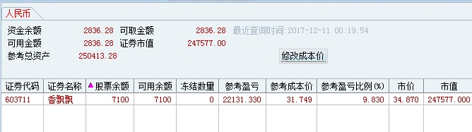

2017-12-11 15:03

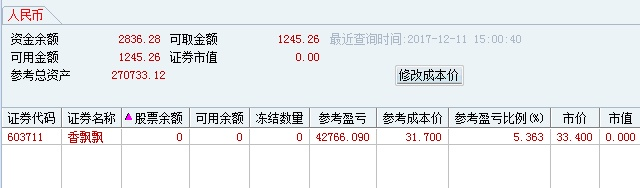

---

2017-12-12 15:04

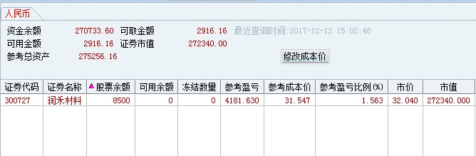

---

2017-12-13 15:04

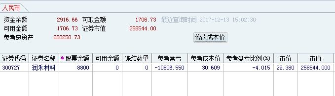

---

2017-12-14 15:02

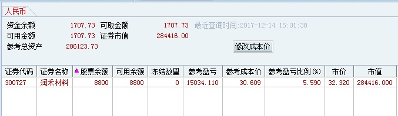

---

2017-12-15 15:02

不玩了，好累，还赚不到钱

---

2017-12-17 23:31

[数据港](https://www.taoguba.com.cn/new/stockbar/barRedirect?stockName=数据港)这个追得有毛病

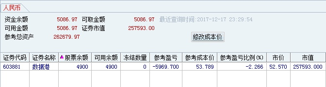

---

2017-12-17 23:35

[汇源通信](https://www.taoguba.com.cn/new/stockbar/barRedirect?stockName=汇源通信)周五成交额161万，创可交易个股单日成交额历史新低

---

2017-12-18 12:10

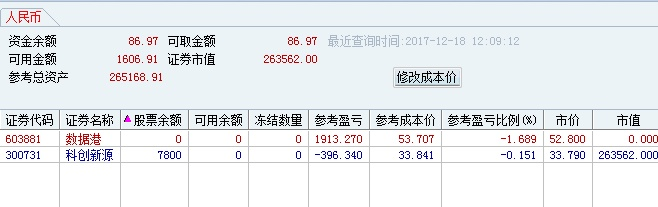

---

2017-12-18 22:06

[ST山水](https://www.taoguba.com.cn/new/stockbar/barRedirect?stockName=ST山水)今天成交额158万，再创A股历史新低

---

2017-12-19 15:01

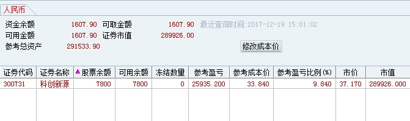

---

2017-12-20 15:06

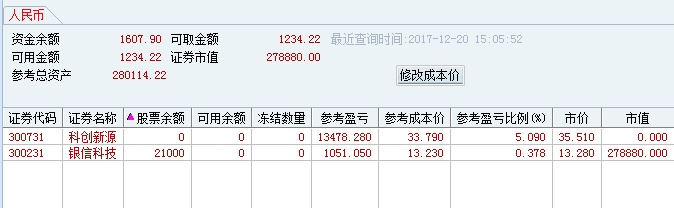

---

2018-01-03 15:02

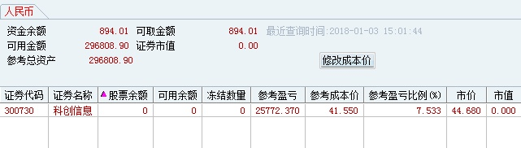

---

2018-01-04 19:48

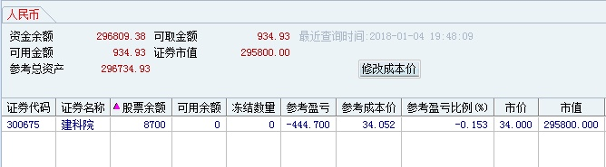

---

2018-01-05 22:41

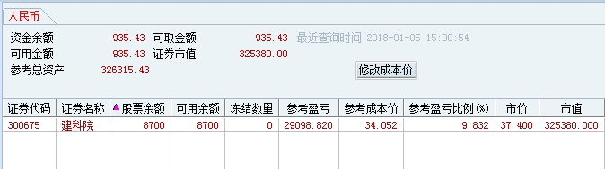

安记食品今日成交额143万

---

2018-01-16 21:26

---

2018-01-24 14:42

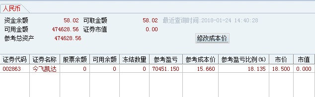

---

2018-02-02 15:13

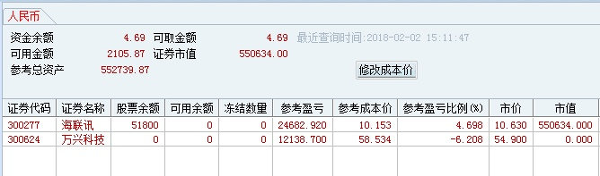

---

2018-02-21 20:16

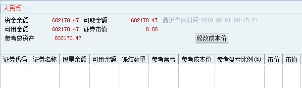

---

2018-02-27 14:50

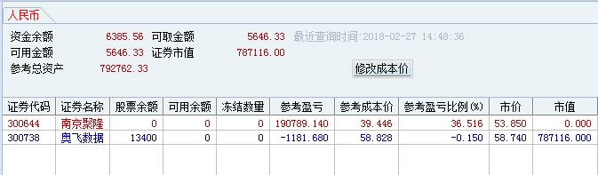

---

2018-03-08 23:30

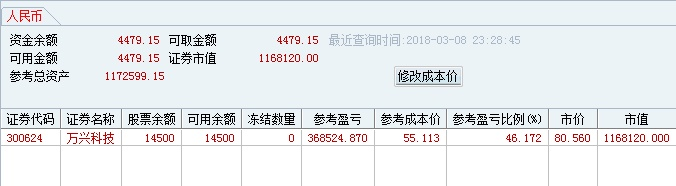

---

2018-03-23 15:00

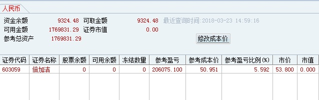

---

2018-04-02 10:13

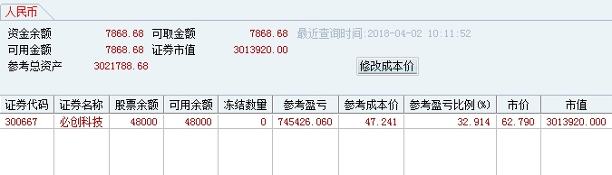

---

## [**250万实盘记录**](https://www.taoguba.com.cn/Article/2031715/1)

2018-08-01 15:31

经过近期的起起落落，以及看到一些吧友的悲惨故事之后，才深刻明白过去的这点成果来之不易，我想我应该要格外珍惜。因此我做了两点改变，一是稳中求进，不在追求短期的暴利；二是把账面上的利润转化到生活中，每天取3~5000元，逐步把车房买了。

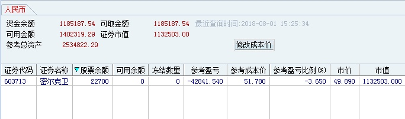

---

2018-08-02 15:05

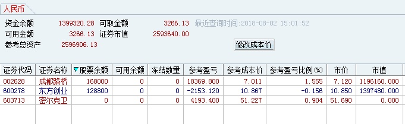

---

2018-08-06 19:53

[@德沃夏克](https://www.taoguba.com.cn/user/blog/atname?n=德沃夏克) 兄好，不要去关注别人的成绩，很多时候成绩只是一时运气，很多人也只是在做得好的时候展示出来，如果你要去跟别人的运气去做比较，怎么会比得过呢？ 把周期拉长一点，接受自己的短暂失意。

---

2018-08-08 20:24

再差的环境都不用着悲观，因为我们有选择不交易的权利，不交易永远不会亏，如果还在担心空仓那几天会错失赚钱的机会，我想这类人要么是亏得不够多，要么是亏得麻木不仁了。

---

2018-08-09 17:07

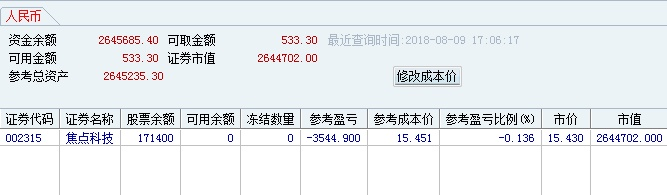

---

2018-08-10 20:05

---

2018-08-15 15:01

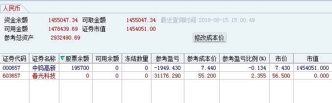

---

2018-08-17 15:04

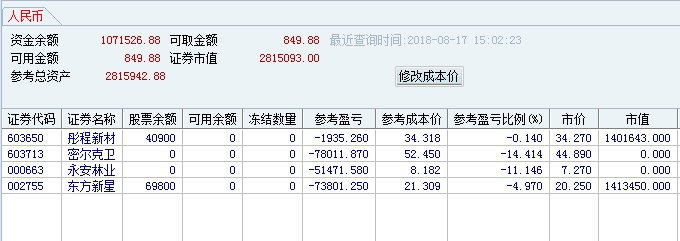

---

2018-09-26 13:18

这股越到后面越没戏，解禁盘马上要出了。前几天要是连续涨停，现在填权龙头妥妥当了。
[引用原文已无法访问]

---

2018-09-28 15:05

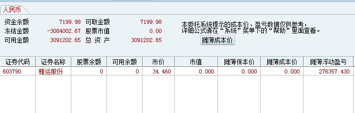

 补上近一个月交割单

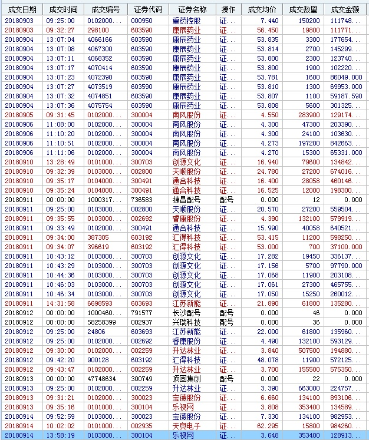

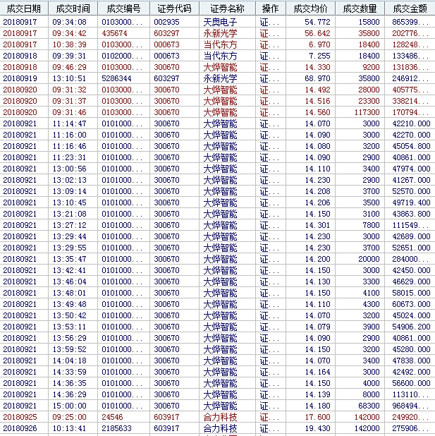

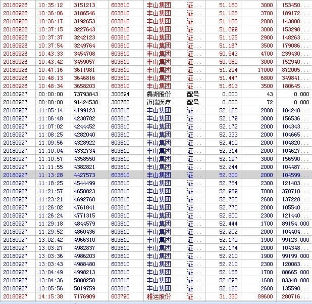

---

2018-10-01 13:50

我交易全凭感觉去做，所以我很少分析买卖逻辑，有时候几秒钟就要做一个决定这真想不出什么逻辑来，想要知道我的买点的看看以前交割单就知道了，就技术水平而言吧，我觉得自己一般般。想走我这条盈利之路的真正要去研究的东西是“我和小明”这篇帖子。

---

2019-01-24

最大的收获是想通了一些道理，股票一般般啊

---

2019-02-11 22:38

用300W操作吧

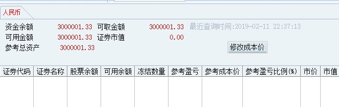

---

2019-03-04 15:50

---

2019-03-12 21:00

好想进一个牛股，一个礼拜不用操作，每天这样换来换去累。

---

2019-03-13 15:02

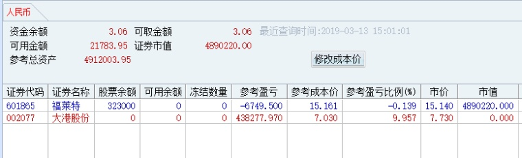

---

2019-03-14 15:09

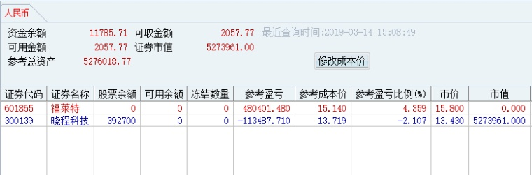

---

2019-03-15 15:01

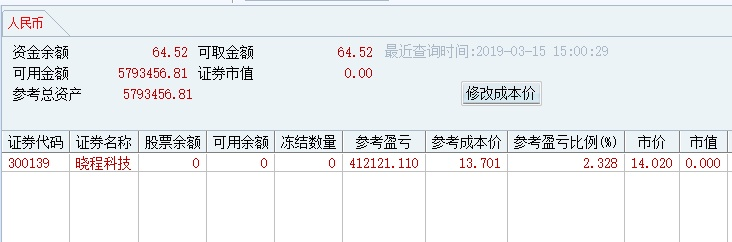

---

2019-03-18 15:04

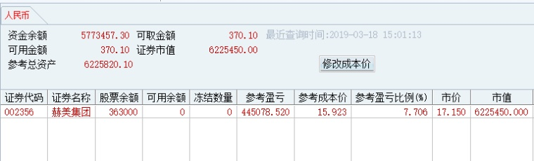

---

2019-03-19 15:05

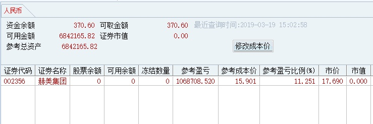

---

2019-03-20 15:18

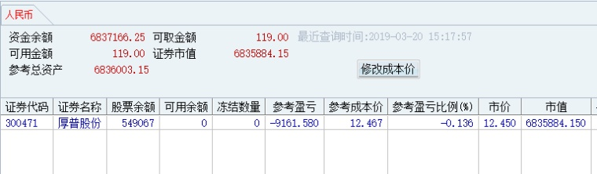

---

2019-03-21 15:04

---

2019-03-28 17:50

刚才有人问怎么才能做到空仓？只要多体验手痒所带来的痛苦就行了，不要去回避。比如盘中盯着你买错的股，看着它一步一步往下跌，而你被锁在里面却无能为力。千万不要删自选，第二天割肉重来，或者借酒消愁打游戏回避，这样错一万次也不会长记性。

---

2019-04-10 15:24

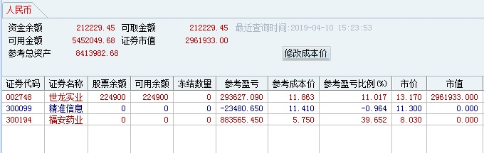

精准昨天这么强势，今天居然低开，这个交割单显示开盘没有快速拉升就直接止损了，赞一个

退学这样的短线高手，很少开盘就卖出，如果像你理解的那样，他是不可能拿住[福安药业](https://www.taoguba.com.cn/new/stockbar/barRedirect?stockName=福安药业)的。[精准信息](https://www.taoguba.com.cn/new/stockbar/barRedirect?stockName=精准信息)大概率是尾盘走掉的，11.30左右卖出，对应他的昨天集合竞价的买入成本11.41，正好亏损不到1%。其实，我们看他的贴单，应该多思考他买入和卖出时候的想法，而不是瞎猜。

---

2019-04-16 15:37

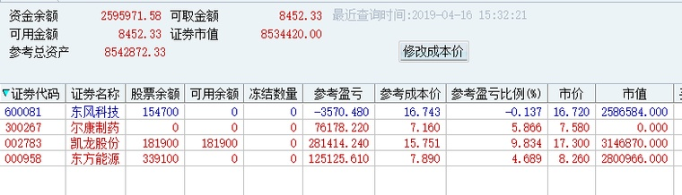

---

2019-04-17 15:02

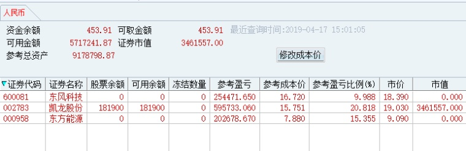

---

2019-04-18 15:04

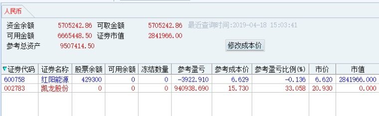

---

2019-04-19 15:02

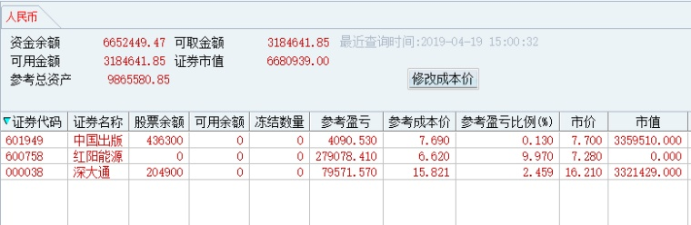

