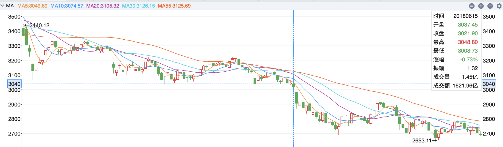

## 闻少语录

[**鉴证新一代顶级游资的成长之路**](https://www.taoguba.com.cn/Article/1989047/1)

2018-06-16 15:25

今天是6.16 大盘下降趋势连续跌了半年以上 且暂无逆转之日 百股跌停 闪崩之时 开第一帖 实盘记录并让大家一路见证新一代游资的成长之路

---

2018-06-29 19:35

[@dangjian520](https://www.taoguba.com.cn/user/blog/atname?n=dangjian520) 在我看来 **打一板 有两个层面** 

**第一个是 情绪周期交替中的那些蠢蠢欲动的新题材的启动一板**

**第二个是高位核心股奠定新地位后 做他属性发散的跟风低位一板**

**第一种属于试错 第二种属于套利 我不太爱试错 所以关于第一种我基本不做 但是第二种我经常做 就是套利 本质是核心高位股稳住后 其他属性的跟风补涨**

**跟风有高位跟风和低位跟风 既然是套利 讲究的就是性价比**

**低位跟风起来的首版 第二天 肉不多 但是很稳 而高位跟风去做套利 风险很大 肉也未知**

所以像641当时乱改特停制度的情况下 那么天花板是四板 就是当时我做跟风一板的逻辑 所以说 根据战场瞬息万变的变化 来改变你的交易策略

