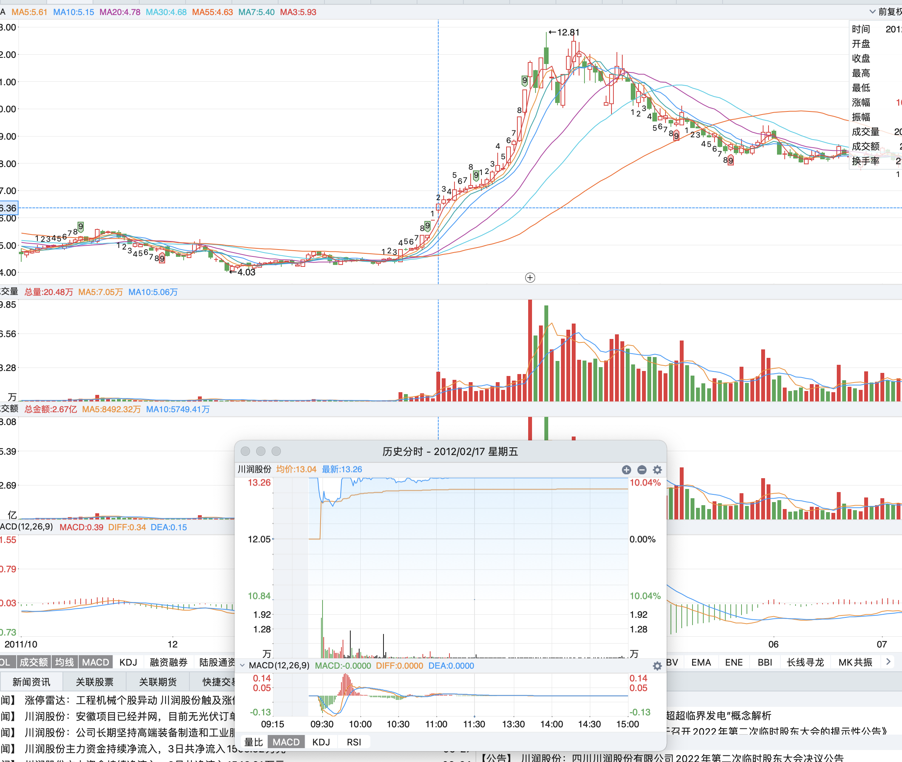
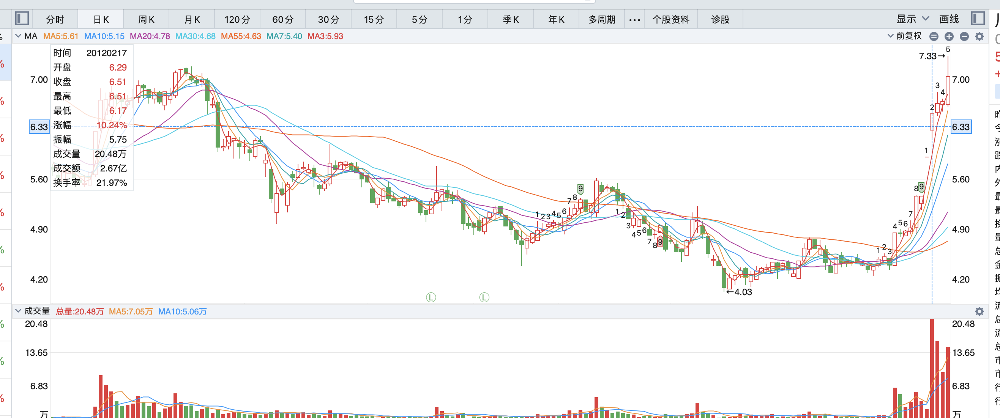

#### 留言

[2021-11-30 22:32](https://www.taoguba.com.cn/Article/3524939/1)

前几年总结的短线战法:

短线战法之一 涨停板过前高，巨量阴线洗盘，第二天敢翻红，就毫不犹豫买进 。经典案例： [300239](https://www.taoguba.com.cn/quotes/sz300239) 、 [300262](https://www.taoguba.com.cn/quotes/sz300262) 、 [002070](https://www.taoguba.com.cn/quotes/sz002070) 。
短线战法之二 连续小阳推升，收缩量阴线，临近收盘买进 ，之后将进入加速拉升段 。经典案例 [300288](https://www.taoguba.com.cn/quotes/sz300288)
短线战法之三 底部一阳穿数线涨停板启动，**放量过头买入法**。 经典案例： [002272](https://www.taoguba.com.cn/quotes/sz002272) 、 [600113](https://www.taoguba.com.cn/quotes/sh600113) 、 [600606](https://www.taoguba.com.cn/quotes/sh600606) 、300262、 [002596](https://www.taoguba.com.cn/quotes/sz002596) 、 [600209](https://www.taoguba.com.cn/quotes/sh600209) 。操作要点：

一、放量突破，一定要拉涨停板，说明主力建仓心切，但是并不代表短线会立马大幅拉升，当日是中短线攻防兼备的买点。
二、连续放量，再买入短线涨幅的概率更大，说明主力短线建仓果断。
2012年2月17日买入 [002272](https://www.taoguba.com.cn/search/fundRegex?fundCode=002272) ，就是运用放量过头买入法 。
2012年4月5日买入 600113 ，也是运用放量过头买入法 。底部一阳穿数线 ，第二天放量过头6.73元。 这种战法， 最重要的是 必须要连续放量 ；突兀的放量，不规则的放量是不好的 ；连续放量 ，才说明是有增量资金介入 ；否则， 就是存量资金了 ，就不要参与。
2012年4月11日买入 600606 是同样的战法。
2012年7月17日买入 600209 是同样的战法。

“2012年2月17日买入 [002272](https://www.taoguba.com.cn/search/fundRegex?fundCode=002272) ，就是运用放量过头买入法 ”

###

[**原创征集—龙头女王分享多年前总结出的3套短线战法**](https://www.taoguba.com.cn/Article/3494872/1)

原创征集—龙头女王分享多年前总结出的3套短线战法

龙头女王早在多年前总结出的3套短线战法,随着时间的推移,时代的变迁,如今看来还是适用的! 现分享给大家!
\----------------------------------------------------------------------------------------------------------------------------------------
上周六(11月6日),龙头女王公布分享的心仪票-- [301089](https://www.taoguba.com.cn/quotes/sz301089) 拓新药业,就是根据本人的短线战法之二挑选出的!
请看上周六(11月6日)公布分享心仪票的分析内容:(目前龙头女王锁仓301089拓新药业浮盈1倍以上!)

(淘股吧： ruirui0724 原创于 2021-11-06 10:11 )
下周一心仪票：

20cm折算2板： 301089 拓新药业（注册制[次新股](https://www.taoguba.com.cn/new/stockbar/other/barRedirect?type=1&&gnName=次新股)+尿苷—处于临床试验阶段的一款名为EIDD-2801的广谱抗病毒新药，具有治疗新冠病毒的潜在功效。该类新药物主要有尿苷组成。）：[中国移动](https://www.taoguba.com.cn/new/stockbar/barRedirect?stockName=中国移动)即将上市，市场势必要打造新股赚钱效应。周五主板次新股[创业](https://www.taoguba.com.cn/new/stockbar/barRedirect?stockName=创业)板次新股都有起势迹象。周五盘面看创业板是人气所在，下周参与套利应该没有问题 。
301089拓新药业 ，注册制次新股，盘子小，股价适中，适合炒作。眸望K线形态，连续小阳推升，周四收缩量阴线，周五跳空跃过上市首日高点，强势封板，干净利落，激活了股性，进入加速拉升阶段，向市场展示出强势，提高了市场辨识度，至少让我这个龙头作手关注到了。周一晋级2板不过份。 下周一计划小仓位参与。
\----------------------------------------------------------------------------------------------------------------------------------------
1.短线战法之一（涨停板突破前高，巨量阴线洗盘法） 具体操作，涨停板过前高，第二天收巨量阴线，第三天敢翻红就毫不犹豫跟进。例子： [600397](https://www.taoguba.com.cn/quotes/sh600397) 安源股份2009年5月8日涨停板突破过前高，第二天收巨量阴线，可收盘买入，第三天敢翻红就坚决跟进，跟进之后收获5个涨停板。
2.短线战法之二（连续小阳推升，收缩量阴线法）：具体操作，连续小阳推升，接着收一根缩量阴线，尾盘买入。这类走势图，后市意味着股价将进入加速拉升！例如： [600379](https://www.taoguba.com.cn/quotes/sh600379) 宝光股份2010年3月8日——3月11日连续小阳推升、3月12日收一根缩量阴线，尾盘买入，之后连续3个涨停板！
3.短线战法之三： 勇于在“空中加油”时介入强势股做第2波。具体操作：如果一只股票走牛而你没有来及骑上，那么还有一个机会，就是在这只黑马奔跑途中加料喝水休整的时候套住它。从技术上，就是在第一波上涨后的二浪调整阶段，趁机介入，也就是在人们常说的“空中加油”时买入，吃它的第二段行情。案例很多.
\----------------------------------------------------------------------------------------------------------------------------------------
龙头女王积极参与淘股吧活动!

特公布分享多年前总结的以上3个短线战法.
股市中，思路决定出路。做资金关注的股票，资本市场，资金说话，股价是靠资金推动的。把自己选股的一些思路和方法，在这里与朋友们分享。个人观点，仅供参考。
